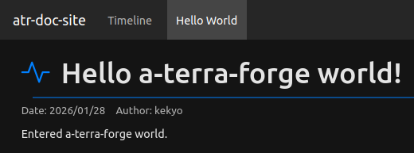
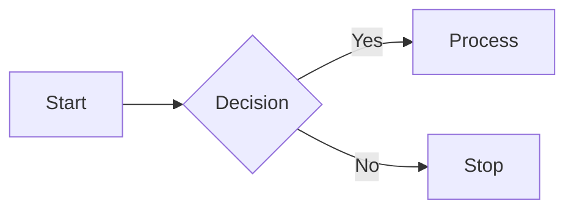

# a-terra-forge

General-purpose Markdown document site generator


[](https://www.repostatus.org/#wip)
[](https://opensource.org/licenses/MIT)
[](https://www.npmjs.com/package/a-terra-forge)

---

[(Japanese language is here/日本語はこちら)](./README_ja.md)

TODO: WIP

## What is this?

Have you ever felt like writing documents that are somewhat organized, bit by bit?
General blog systems are cumbersome to manage, and simple blog generators are primarily designed for writing "blogs," so documents tend to lack cohesion and can be hard for readers to follow smoothly.

"a-terra-forge" is a document site generator that allows you to organize and display documents by category, and track documents in progress chronologically on a timeline page.
The site is built fully static, so no server code is required.
Documents can be written in Markdown, and it also supports rich expressions such as:

### Light/Dark theme


### Embedded content, cards, and graphs (Mermaid)


### Block quotes and syntax highlighting


### Images and popup


### Responsive design


Features:

- As a static site generator, no server is required. You can deploy and publish to any web server, such as GitHub Pages.
- The timeline page also statically generates the latest documents, while older articles use infinite scroll (on-demand loading).
- Documents are written in Markdown. Markdown supports syntax highlighting for code, card display for oEmbed/OGP sources, and Mermaid rendering by default.
- HTML rendering uses [mark-deco](https://github.com/kekyo/mark-deco/), while page composition performs script-based processing via [funcity](https://github.com/kekyo/funcity/).
  Therefore, pages can be highly customized.
- With the Vite plugin, you can write documents while previewing pages in your browser.
- Document management assumes Git. Document timestamps and author information are automatically collected from Git, so manual frontmatter management is mostly unnecessary.
  Document writing management can follow standard Git workflows and is suitable for users who regularly write code.
- Since everything is built with TypeScript/NPM, you can start using it immediately as long as Node.js is installed.
- Standard support for publishing information via sitemaps, RSS, and Atom is included.
- The default template assets deliver simple, modern pages using [Bootstrap](https://getbootstrap.jp/).
  Of course, it is flexible enough to use a completely different UI framework without Bootstrap.

---

## Getting started with writing

First, install the a-terra-forge CLI (command line interface) via NPM.
If Node.js is installed on your system, you can start using it immediately.

- For example, Ubuntu often has a system Node.js installed, so you can use that. You can check with `node --version`. If it does not exist, install it with `sudo apt install nodejs`.
- In other environments, you can install from [Download Node.js](https://nodejs.org/en/download).

Then you can install the CLI with the following NPM command:

```bash
$ npm i -g a-terra-forge
```

There are two main usage patterns: using the CLI directly, and using the Vite plugin.
In either case, there is a scaffold generation feature.

- Using the CLI directly is the basic way to use a-terra-forge. There are commands to generate a new document scaffold and to build the site.
- The Vite plugin uses [Vite](https://vite.dev/) for web development to preview the built site in a browser.
  When you save documents, the page preview updates automatically, enabling a pseudo [WYSIWYG](https://en.wikipedia.org/wiki/WYSIWYG) experience where you can always write while watching the page.

Unless there is a particular reason, it is recommended to write using the Vite plugin.
Even so, the usage is very simple, so there is no need to worry.

Writing itself can be done with a text editor/Markdown editor such as [Visual Studio Code](https://code.visualstudio.com/).
No special word processor application is required.

To write documents, you need to create a directory called an "editing space" to store your documents.
By managing this editing space with Git, you can easily implement version control for documents.

The following sections show the steps to initialize the editing space and prepare for writing.

### Initialize an editing space (using Vite)

If you use the Vite plugin, run the following command to generate an editing space in the current directory:

```bash
$ mkdir my-site
$ cd my-site
$ atr init
a-terra-forge - Universal document-oriented markdown site generator
Copyright (c) Kouji Matsui (@kekyo@mi.kekyo.net)
License under MIT
https://github.com/kekyo/a-terra-forge

Scaffold created at /home/kouji/my-site
```

This creates the following files:

```
my-page
├── atr.json
├── dist
├── docs
│   ├── about
│   │   ├── a-terra-forge.png
│   │   └── index.md
│   └── hello
│       ├── article-demo.md
│       ├── demo-image.jpg
│       ├── index.md
│       └── rich-demo.md
├── package.json
├── templates
│   ├── atom.xml
│   ├── blog-entry.html
│   ├── category-entry.html
│   ├── feed.xml
│   ├── index-blog.html
│   ├── index-category.html
│   ├── index-timeline.html
│   ├── navigation-bar.html
│   ├── sitemap.xml
│   ├── site-script.js
│   ├── site-style.css
│   └── timeline-entry.html
├── vite.config.ts
├── .github
│   └── workflows
│       └── build.yml
└── .gitignore
```

To use the Vite plugin, run the following command once (the output may differ slightly):

```bash
$ npm i
added 306 packages, and audited 307 packages in 16s

152 packages are looking for funding
  run `npm fund` for details

found 0 vulnerabilities
```

After that, you can preview by running the following command when you want to edit.
Your system's default web browser will open automatically to display a preview of the site:

```bash
$ npm run dev
[atr-vite] a-terra-forge - Universal document-oriented markdown site generator
[atr-vite] Copyright (c) Kouji Matsui (@kekyo@mi.kekyo.net)
[atr-vite] License under MIT
[atr-vite] https://github.com/kekyo/a-terra-forge

  VITE v7.3.1  ready in 597 ms

  ➜  Local:   http://localhost:5173/
  ➜  Network: use --host to expose
  ➜  press h + enter to show help
[atr-vite] Preparing...
[atr-vite] Render each articles [4]...
[atr-vite] renderer: entry time max=2144.04ms avg=686.66ms (4 entries)
[atr-vite] renderer: total time 2493.13ms
[atr-vite] Finalizing now...
[atr-vite] built: dist/about/index.html
[atr-vite] built: dist/hello/index.html
[atr-vite] built: dist/index.html
[atr-vite] built: dist/site-script.js
[atr-vite] built: dist/sitemap.xml
[atr-vite] built: dist/atom.xml
[atr-vite] built: dist/feed.xml
[atr-vite] built: dist/site-style.css
```


The page shown includes the scaffold's sample documents and images.
You might feel uneasy if documents already exist or everything is bright blue, but there is no need to worry.
You can quickly delete them, start writing from scratch, and adjust the appearance (At least, the accent color can be easily changed).

When the preview is displayed, the document site has already been built, but to build it manually, use the following command:

```bash
$ npm run build
```

The built files are output to the `dist/` directory.
At this point, it should look like this:

```
dist/
├── about
│   ├── a-terra-forge.png
│   └── index.html
├── article-bodies
│   ├── 0.html
│   ├── 1.html
│   ├── 2.html
│   └── 3.html
├── atom.xml
├── feed.xml
├── hello
│   ├── demo-image.jpg
│   └── index.html
├── index.html
├── sitemap.xml
├── site-script.js
├── site-style.css
└── timeline.json
```

Deploy these files to a server to publish.
As you can see, feeds such as sitemaps and RSS/Atom are generated automatically.

To automatically deploy to GitHub Pages, see the section below.

### Initialize an editing space (using the CLI)

If you do not use the Vite plugin, generate the document site editing space with the following command:

```bash
$ mkdir my-site
$ cd my-site
$ atr init --no-vite
a-terra-forge - Universal document-oriented markdown site generator
Copyright (c) Kouji Matsui (@kekyo@mi.kekyo.net)
License under MIT
https://github.com/kekyo/a-terra-forge

Scaffold created at /home/kouji/my-page
```

This creates the following files:

```
my-page
├── atr.json
├── dist
├── docs
│   ├── about
│   │   ├── a-terra-forge.png
│   │   └── index.md
│   └── hello
│       ├── article-demo.md
│       ├── demo-image.jpg
│       ├── index.md
│       └── rich-demo.md
├── templates
│   ├── atom.xml
│   ├── blog-entry.html
│   ├── category-entry.html
│   ├── feed.xml
│   ├── index-blog.html
│   ├── index-category.html
│   ├── index-timeline.html
│   ├── navigation-bar.html
│   ├── sitemap.xml
│   ├── site-script.js
│   ├── site-style.css
│   └── timeline-entry.html
├── .github
│   └── workflows
│       └── build.yml
└── .gitignore
```

To build the document site, use the following command:

```bash
$ atr build
a-terra-forge - Universal document-oriented markdown site generator
Copyright (c) Kouji Matsui (@kekyo@mi.kekyo.net)
License under MIT
https://github.com/kekyo/a-terra-forge

Preparing...
Render each articles [4]...
renderer: entry time max=2630.03ms avg=784.29ms (4 entries)
renderer: total time 2966.43ms
Finalizing now...
built: dist/about/index.html
built: dist/hello/index.html
built: dist/index.html
built: dist/atom.xml
built: dist/feed.xml
built: dist/sitemap.xml
built: dist/site-script.js
built: dist/site-style.css
```

The built files are output to the `dist/` directory.
At this point, it should look like this (the same as when using the Vite plugin):

```
dist
├── about
│   ├── a-terra-forge.png
│   └── index.html
├── article-bodies
│   ├── 0.html
│   ├── 1.html
│   ├── 2.html
│   └── 3.html
├── atom.xml
├── feed.xml
├── hello
│   ├── demo-image.jpg
│   └── index.html
├── index.html
├── sitemap.xml
├── site-script.js
├── style.css
└── timeline.json
```

Deploy these files to a server to publish.
As you can see, feeds such as sitemaps and RSS/Atom are generated automatically.

To automatically deploy to GitHub Pages, see the section below.

---

## Managing documents

You may have experienced not liking the documents you wrote, writing several candidates and choosing one, or polishing them later.
In such cases, using Git for version control allows editing work to be flexible and safe.

For software developers, who manage source code with Git daily, this should be easy to understand.

In this chapter, we prepare to manage the editing space with Git and extend it to automatically publish the site.
Once these preparations are complete, you should have an environment that lets you focus on writing.

### Manage the editing space with Git

First, manage the editing space with Git so you can perform version control.
That way, incorrect edits, page customizations, or text you do not like can easily be reverted.

Register the current state of the editing space as the first version (commit) in Git with the following commands:

```bash
$ git init
Initialized empty Git repository in /home/kouji/my-page/.git/
$ git add -A
$ git commit -m "Initial commit"
[main (root-commit) e5fc1c0] Initial commit
 19 files changed, 2547 insertions(+)
 create mode 100644 .github/workflows/build.yml
 create mode 100644 .gitignore
 create mode 100644 atr.json
    :
    :
    :
```

Now the editing space is managed by Git.

Do you remember the preview being entirely bright blue?
In fact, a-terra-forge uses a blue background to show documents that are being edited and have not been committed to Git.

If you check after committing, you will see that the background is white (or black).
The date and author name obtained from Git will also be displayed:


There are many explanations and books about how to use Git. Referring to them will deepen your understanding of version control.
Also, these days you can just ask ChatGPT to explain what to do.

### Publish pages fully automatically

The scaffold generated by the `atr init` command includes a [GitHub Actions](https://docs.github.com/en/actions/get-started/understand-github-actions) script:

```
├── .github
│   └── workflows
│       └── build.yml
```

If you store the editing space on GitHub, you can use this script to publish pages fully automatically.

- Note: This script can only be used when you manage versions with Git and store them on GitHub.
  It is not impossible to do the same thing in other environments, but you will need to do it yourself.
  Therefore, the following steps assume that you have registered a GitHub account and created a remote repository to store the editing space.

If you allow publishing from GitHub Actions in the GitHub Pages settings, you can deploy the site just by pushing to GitHub.

Below is an example of the GitHub Pages settings.
Click the `Settings` tab of the remote repository, then `Pages`, and select `GitHub Actions` from the dropdown list:


When you are ready, push your branch to the remote repository. GitHub Actions will run automatically, and the page will be published in tens of seconds to a few minutes.
The site URL should be `https://<account-name>.github.io/<repository-name>/`.

If you want to check the status of GitHub Actions, see the following page:


### Overall configuration of the document space

a-terra-forge manages the overall document space using a file called `atr.json`.
This file is in JSON format (strictly speaking, JSON5) and includes site-wide settings, message lists, and more.
Below is a partial excerpt of `atr.json`:

```json
{
  "variables": {
    "baseUrl": "https://atr-doc-site.github.io",
    "siteName": "atr-doc-site",
    "siteDescription": "Sample a-terra-forge site",
    "frontPage": "timeline",
    "headerIcon": "activity",
    "primaryColor": "#0080ff",
    "secondaryColor": "#40ff40",
    "inlineCodeColor": "#0080ff",
    "menuOrder": ["timeline", "hello"],
    "afterMenuOrder": ["about"]
  }
}
```

The definitions included in `variables` above are treated as "variables" and are defined so they can be referenced by a-terra-forge's internal processing and template scripts (described later). These values can be used to adjust overall site generation and appearance.

Below is an explanation of these values:

|Variable name|Details|
|:----|:----|
|`baseUrl`|Specifies the base URL where this site will be published after deployment. It does not affect the navigation menu, but it is required for sitemap generation, so be sure to set it. |
|`siteName`|The site name of this site, used for the left end of the navigation menu and for embedding page metadata.  |
|`siteDescription`|The site description, used for embedding page metadata.  |
|`frontPage`|Specifies which category to display as the site's front page (top page). The default is `timeline`, which is a special category name that shows the timeline. |
|`headerIcon`|The icon displayed in document titles. The name is specified using [Bootstrap Icons](https://icons.getbootstrap.com/). You can also specify it per document, but this value is used when omitted.|
|`primaryColor`|Specifies the primary accent color for the site. The scaffold uses many blue accents because of this setting. If you change this color, you can use your preferred accent color. However, do not forget to try colors that are well balanced between the system light and dark themes.                                     |
|`secondaryColor`|Specifies the secondary accent color for the site. The secondary color is currently used only in block quotes. |
|`inlineCodeColor`|Specifies the inline code color for the site. This is the color of text enclosed in backticks in Markdown (inline code). The background color of inline code is also colored based on this setting. |
|`menuOrder`|A list that determines the order in which recognized categories are displayed in the navigation menu. Categories not explicitly listed here are placed at the end of the list. Categories explicitly listed but not present are ignored. |
|`afterMenuOrder`|A list that determines the order in which recognized categories are displayed in the navigation menu. However, this list is displayed right-aligned in the navigation menu. Use this if you want to separate them from general categories. |

For example, changing `primaryColor` to `#ff4040` will alter the accent color as follows:


The variables above include several items for adjusting categories. These are settings based on categories, so you should check them again after referring to the categories described later.

`atr.json` still contains many predefined variables, but these will be covered in a separate chapter.

---

## How to write documents

Alright, let's get started writing!

"a-terra-forge" handles documents by category. When you write documentation, decide a category name and write it as documents of that category.
Categories are recognized by creating subdirectories under the `docs/` directory. For example, the following is part of the scaffold generated by `atr init`:

```
my-page
└── docs
    ├── about
    │   ├── a-terra-forge.png
    │   └── index.md
    └── hello
        ├── article-demo.md
        ├── demo-image.jpg
        ├── index.md
        └── rich-demo.md
```

The scaffold has three categories: `about`, `hello` inside `docs/`, and the timeline `timeline`.
The timeline category is special and can be generated even if it does not exist under `docs/`.

Placing files inside these category directories will make them recognized as that category.
In particular, `index.md` is always placed first in that category document. Other markdown files (`*.md`) are concatenated right after `index.md` to generate the document.

You may write all documents in `index.md`, or you may split them into multiple Markdown files.
Splitting files allows only the edited portion to appear on the timeline when you edit a file. This makes it easier for readers to see which documents were recently updated. Especially for lengthy documents, it's advisable to split chapters into separate files.

### frontmatter

Documents are written in markdown, and you can add "frontmatter" at the top of the file:

```markdown
---
title: Today's cat
---

He slept behind the monitor all day. From time to time he stared vacantly out the window, and when he realized there was nothing interesting, he fell asleep again.
```

`title` represents the document title. You can specify it manually like this, but if a markdown header `# ...` exists at the beginning of the document, it is automatically converted into the title.
This frontmatter also supports other values. Using `order` lets you specify the concatenation order for articles other than `index.md` (see the scaffold's `hello` category).

Below is a list of values you can specify in frontmatter:

|Key|Details|
|:----|:----|
|`title`|Title. If omitted, it is automatically moved from the first markdown header `# ...`.|
|`id`|An ID that uniquely identifies this document. Automatically assigned.|
|`order`|An ascending number that determines the concatenation order of this document. The numbers do not have to be continuous. Note that `index.md` is always placed first.|
|`headerIcon`|The icon name shown in the leading header. Specify a Bootstrap Icons name. The default follows `atr.json`.|
|`hideMeta`|If `true`, date and author are not displayed (except on the timeline). This can be used when you want to perform rendering similar to that of a static (fixed) page.|
|`draft`|If `true`, the document is not rendered. Use this for drafts you do not want to publish.|
|`tags`|A list of tags applied to the document. There are no predefined tag names. If specified, they are set in the page's OGP metadata. This is optional.|

### Create a category

You can create a category directory yourself and start writing by placing an `index.md`, but the CLI can generate a scaffold easily:

```bash
$ atr new food
a-terra-forge - Universal document-oriented markdown site generator
Copyright (c) Kouji Matsui (@kekyo@mi.kekyo.net)
License under MIT
https://github.com/kekyo/a-terra-forge

New article created: food/index.md
```

This generates a new `docs/food/` directory and puts an `index.md` scaffold inside it.
Note that this `index.md` has `draft: true`, so it will not be included in the preview.

- If a category is no longer needed, simply delete that category directory.
- You can create subcategories:
  - If a subcategory exists, you cannot place content in the parent category.
    Any existing document files in the parent category must be moved into a subcategory or an another category.
  - Further nested categories (grandchildren) are not supported.

When you create a category, a menu item is automatically added to the navigation bar:


If a subcategory exists, it becomes a dropdown menu:


### Navigation menu

When you created a new category, you might have noticed the position of the navigation menu.
In the previous section, you were able to create `food`, `develop/server`, and `develop/web`,
but you might want to place `food` to the right of `develop`, or change the order of submenus:


This order can be specified by the `menuOrder` variable in `atr.json`:

```json
{
  "variables": {
    "menuOrder": ["timeline", "hello", "food", "web", "server"],
  }
}
```

For `menuOrder`, specify the category directory names. Even for subcategories, do not specify the parent category name; specify only the subcategory name.
Navigation menu items are placed to keep the order specified in this list.

Note that even if you specify subcategory names as if the parent categories were split, the menu arrangement will not follow that structure, and only the order will be reflected.
In other words, the following settings yield the same result:

- `"menuOrder": ["timeline", "hello", "web", "food", "server"]`
- `"menuOrder": ["timeline", "hello", "web", "server", "food"]`

If there are categories not listed here, they are added to the end of the menu.

You might also notice that the scaffold's `about` category is placed at the far right.
If you place it on the far left, you can separate it from self-introduction and other contents:


This can be specified by the `afterMenuOrder` variable:

```json
{
  "variables": {
    "afterMenuOrder": ["about"],
  }
}
```

Note that `afterMenuOrder` is always evaluated after `menuOrder`.
If a category specified in `afterMenuOrder` is included in `menuOrder`, it will be placed in the left group.

The timeline category is special, but by using the category name `timeline`, you can also adjust its position in the navigation menu.
You can deliberately place the timeline on the far right (`afterMenuOrder`) to make a site that highlights proofread documents.

### Front page and Timeline

The front page is the top page of the site. When published at a URL like `http://foobar.github.io/foobar/`, it is served as `http://foobar.github.io/foobar/index.html`.

So far, this guide has assumed that a-terra-forge always shows the timeline page as the front page,
but you can change the front page to any category. The following example changes the front page to `food`:

```json
{
  "variables": {
    "frontPage": "food",
  }
}
```

Changing the front page also changes the location of deployed asset files.

For example, when the default timeline is the front page, timeline asset files (`timeline.json`, `timeline-bodies/*`: auto-generated) are placed directly under `dist/`.
If you change the front page to `food`, the `food` asset files are placed directly under `dist/`, and the timeline is placed under `dist/timeline/`.

In other words, the URL paths visible to visitors change.
The page structure is also reflected in the sitemap, so search engine crawlers can detect the change, but frequent changes will likely incur a penalty.
(It might be putting the cart before the horse to let search engines stop you in your tracks.)

Additional Notes on the timeline:

- Specifying `timeline` in `frontPage`, omitting `frontPage`
- Or placing `timeline` anywhere in `menuOrder` or `afterMenuOrder`

Will generate a timeline page.
However, if no `timeline` specification exists, the timeline page will not be generated.

While generating the timeline page is one of a-terra-forge's distinctive features and we encourage its use,
if it is absolutely unnecessary, you can omit the timeline page in this manner.

### Message replacement

There should still be a rendering detail that hasn’t been explained yet: the names shown in the navigation bar and the category badges on the timeline:


This category is placed under `docs/hello/`, but as shown above it is displayed as `Hello world`.
Up to this point, category directory names were displayed as-is.

To customize this, define the `messages` variable in `atr.json`:

```json
{
  "variables": {
    "locale": "en"
  },
  "messages": {
    "en": {
      "date": "Date",
      "author": "Author",
      "category": "Category",
      "timeline": "Timeline",
      "hello": "Hello World",
      "about": "About",
      "endOfTimeline": "End of timeline.",
      "noArticlesYet": "No articles yet.",
      "uncommitted": "uncommitted"
    },
    "ja": {
      "date": "日時",
      "author": "執筆者",
      "category": "カテゴリ",
      "timeline": "タイムライン",
      "hello": "ハローワールド",
      "about": "About",
      "endOfTimeline": "タイムラインは以上です",
      "noArticlesYet": "文書はありません",
      "uncommitted": "未コミット"
    }
  },
}
```

As you can see, the definition is split into English and Japanese, and `messages.en.hello` is set to `Hello World`. That is what you see on the screen.

- If a category name is not defined in this variable, it is rendered as the category name itself. That’s why `food` was rendered as `food`.
  Try adding a definition like `"food": "The Food"`. Don’t forget the comma.
- Directly under `messages`, you place the locale names (languages).
  In the example above, that’s `en` and `ja`, and they correspond to `variables.locale`. Since the template sets it to `en`, `messages.en.hello` is used.
- Locale names are not limited to `en` and `ja`; you can use any name you like.
  I only know Japanese and (barely) English, so the template includes just those two.
  What is your native language? Please add it here and customize it.

This `messages` mapping is used not only for resolving category names, but also for several common UI elements.
If you change `variables.locale` from `en` to `ja`, you should be able to see it:


You might also prefer not to output the author’s Git signature as-is. If you add settings like this:

```json
{
  "messages": {
    "en": {
      "Kouji Matsui": "kekyo"
    },
    "ja": {
      "Kouji Matsui": "kekyo"
    }
  },
}
```

the author name can be replaced automatically:



This is implemented by the `getMessage` function in the funcity script. If you want to apply `messages` to places that do not reference it in the existing template, or even in your own customized HTML, refer to “Customize templates” below.

### Blog Categories

a-terra-forge also includes functionality for writing blogs.
However, since this is an optional feature, you must enable it using the following method:

- The blog feature displays posts from specified categories in a blog-like format, sorted in reverse chronological order.
- Specify the categories to use as blogs in `variables.blogCategories` within `atr.json`.
  Since this method repurposes existing categories, you can display any category (or multiple categories) as a blog.
- The blog page renders very similarly to a timeline. The latest document is statically generated, while older articles use infinite scroll (demand loading).
  Therefore, even as the blog accumulates content over time, the physical HTML size of a single page can be constrained within a certain range.

Specify the category names to repurpose as blogs as follows:

```json
{
  "variables": {
    "blogCategories": ["blog"]
  },
}
```

The placement of menus within the navigation menu is determined by specifications such as `menuOrder` mentioned earlier, so the placement flexibility is the same as for regular categories.
Similar to the timeline, dynamically loaded HTML is placed in `blog-bodies/`.

---

With this, the basic writing workflow for a-terra-forge is covered.
From here on, we will explain how to insert content other than documents.

### Insert images

To insert images in a document, just place the image in the category directory and write a Markdown image reference:

```markdown

```

The image is automatically rendered inside a frame called a "panel", positioned on the right (it takes the full width when the viewport is narrow). The text following the image wraps around it, so you can read the document while referencing the image.
When a reader clicks the image, it pops up and (if the viewport is wide enough) shows a larger view.


If you wrap the image in a Markdown link like this, clicking it will not zoom; it simply opens the link.

```markdown
[](https://example.com/banana/)
```

Placing and referencing images is a tedious task in many blog systems.
In a-terra-forge, that work is delegated to the editor you use.

For example, in Visual Studio Code, open the Markdown file in the editor and drag and drop an image file into it (hold Shift). The image file is copied automatically and a definition like `` is inserted:


Then just tweak it a bit and the image placement is done.

### Insert code

If you write Markdown regularly, code blocks should be familiar.
They render text-file-like content in a readable way, and in Markdown you write them like this:

````markdown
```typescript
const run = async (
  script: string,
  logs: FunCityLogEntry[] = []
): Promise<string> => {
  // Run the tokenizer
  const blocks: FunCityToken[] = runTokenizer(script, logs);

  // :
  // :
  // :

  const text: string = results.join('');
  return text;
};
```
````

When you start with three backticks and an optional language label like ` ```typescript ... ``` `, everything until the next three backticks is treated as a code block. The text is then rendered like this:


- Code blocks expand to the full viewport width. This reduces horizontal scrolling and improves readability.
- Code blocks have a copy button (top right) for copy and paste. Line numbers are not included in copied code, so it is easy to paste and run.
- Code block rendering is done with [Shiki](https://shiki.style/). See https://shiki.style/languages for supported languages.

The code block border uses the color based on `primaryColor`, but syntax highlighting follows the Shiki theme. Other Shiki settings are configured under `codeHighlight` in `atr.json`:

```json
{
  "codeHighlight": {
    "lineNumbers": true,
    "theme": {
      "light": "light-plus",
      "dark": "dark-plus"
    }
  }
}
```

|Key|Details|
|:----|:----|
|`lineNumbers`|Show line numbers when `true`.|
|`theme`|Specifies the themes to apply. You can set different themes for light and dark. See https://shiki.style/themes for available names. Defaults are `light-plus` and `dark-plus`, similar to Visual Studio Code.|

### Insert cards

Cards are external links rendered in a style like this:


There are two main types of cards.

- oEmbed card: For links supported by an [oEmbed provider](https://oembed.com/), embedded content is shown (for example, YouTube lets you play a preview in the page), so the link becomes interactive.
- OGP card: For pages that provide [Open Graph protocol](https://ogp.me/) metadata, the link is rendered as a card using that metadata.
  a-terra-forge also uses this for pages that do not provide OGP metadata.

To show a link as a card, just use a Markdown code block with `card` and write the link:

````markdown
```card
https://youtu.be/mfv0V1SxbNA
```
````

If the specified link is supported by an oEmbed provider, it automatically tries to render it as embedded content.
Otherwise, it renders it as an OGP card.

The first example was a YouTube link, so it rendered as an oEmbed card.
The next example is a GitHub link; GitHub provides OGP metadata, so it renders as an OGP card:


In both cases, the card is placed in a "panel" like images, and when the viewport is wide enough the text wraps around it.

Fetching oEmbed and OGP metadata is handled by [mark-deco](https://github.com/kekyo/mark-deco/). To avoid repeatedly sending the same requests for the same link, access to these providers is cached.
Cached data is stored under the `<home directory>/.cache/a-terra-forge/` directory.
If you encounter errors that won't go away, try deleting this directory.

### Insert a graph using Mermaid

With [Mermaid](https://mermaid.js.org/), you can embed diagram graphs directly in the document.
Just use a fenced code block with `mermaid` and write the diagram definition:

````markdown

````

The diagram is rendered automatically and displayed in the document:


Because the definition stays as plain text, it works well with diffs and code review.
However, it may be difficult to write code without seeing how the results are displayed.

For example, using a [third-party extension for Visual Studio Code](https://marketplace.visualstudio.com/search?term=mermaid&target=VSCode&category=All%20categories&sortBy=Relevance) allows you to check and edit graph results much more quickly.

Note: Unlike other embedding features, Mermaid outputs the graph code almost verbatim into HTML.
The actual "graph shapes" are drawn by Mermaid's runtime JavaScript code executed in the client-side browser.

Therefore, SVG code is not output directly to HTML; a reference to the Mermaid runtime is required.
The a-terra-forge template includes this code, allowing you to start using it immediately.
However, you may want to be aware of this when customizing the template.

---

## atr.json

Below are all values defined in `atr.json`:

|Variable name|Template only|Details|
|:----|:----|:----|
|`baseUrl`|No|Specifies the base URL where this site will be published after deployment. It does not affect the navigation menu, but it is required for sitemap generation, so be sure to set it. |
|`siteName`|No|The site name of this site, used for the left end of the navigation menu and for embedding page metadata.  |
|`siteDescription`|No|The site description, used for embedding page metadata.  |
|`locale`|No|The language setting for the entire site. You can also specify it per document, but this value is used when it is omitted. For example, `en` for English and `ja` for Japanese. Even if you make this selection, the content will not be automatically translated. |
|`frontPage`|No|Specifies which category to display as the site's front page (top page). The default is `timeline`, which is a special category name that shows the timeline. |
|`headerIcon`|Yes|The icon displayed in document titles. The name is specified using [Bootstrap Icons](https://icons.getbootstrap.com/). You can also specify it per document, but this value is used when omitted.|
|`primaryColor`|Yes|Specifies the primary accent color for the site. The scaffold uses many blue accents because of this setting. If you change this color, you can use your preferred accent color. However, do not forget to try colors that are well balanced between the system light and dark themes. |
|`secondaryColor`|Yes|Specifies the secondary accent color for the site. The secondary color is currently used only in block quotes. |
|`inlineCodeColor`|Yes|Specifies the inline code color for the site. This is the color of text enclosed in backticks in Markdown (inline code). The background color of inline code is also colored based on this setting. |
|`maxWidth`|Yes|Specifies the maximum width of the document area. The default is unlimited, allowing it to expand freely to match the viewport's width. If it expands too far horizontally, it can become difficult to follow lines with our eyes. Specifying a value like `90rem` can prevent this. |
|`siteTemplates`|No|Site-wide asset files and a group of template files that are processed with funcity scripts. CSS and JavaScript files, RSS/Atom, and sitemaps are all processed as scripts and output. If you add files that require additional script processing to this list, they will also be recognized as script processing targets.  Defaults are: `site-style.css`,`site-script.js`,`feed.xml`,`atom.xml`,`sitemap.xml`. |
|`contentFiles`|No|Specifies glob patterns for static files to copy from under `docs` during build. Use this to publish assets like images alongside generated pages. Defaults are: `./**/*.png`, `./**/*.jpg`. |
|`docsDir`|No|Overrides the documents directory. Default is `docs/`. The path is resolved relative to the directory containing `atr.json`. |
|`templatesDir`|No|Overrides the templates directory. Default is `templates/`. The path is resolved relative to the directory containing `atr.json`. |
|`outDir`|No|Overrides the output directory. Default is `dist/`. The path is resolved relative to the directory containing `atr.json`. |
|`tmpDir`|No|Overrides the temporary working directory. Default is system temporary directory. The path is resolved relative to the directory containing `atr.json`. |
|`cacheDir`|No|Overrides the oEmbed/OGP discovery cache directory. Default is `$HOME/.cache/a-terra-forge/`. The path is resolved relative to the directory containing `atr.json`. |
|`feedSummaryLength`|No|Maximum length for RSS/Atom entry summaries. Default is `200`. |
|`feedTitle`|No|RSS/Atom feed title. Defaults to `siteName` or `"feed"` when `siteName` is empty. |
|`feedDescription`|No|RSS/Atom feed description. Defaults to `siteDescription`. |
|`prerenderCount`|No|Number of entries pre-rendered into the page. Use a positive integer; when omitted, default is `5`. |
|`menuOrder`|No|A list that determines the order in which recognized categories are displayed in the navigation menu. Categories not explicitly listed here are placed at the end of the list. Categories explicitly listed but not present are ignored. |
|`afterMenuOrder`|No|A list that determines the order in which recognized categories are displayed in the navigation menu. However, this list is displayed right-aligned in the navigation menu. Use this if you want to separate them from general categories. |

- "Template only" means that the a-terra-forge conversion process does not use this value; it is referenced as a variable within the template assets.
- In addition to the variables shown here, you can also use the [standard variables available in funcity](https://github.com/kekyo/funcity#standard-functions).
- You can also define your own custom variable values and reference them within your funcity script.
  This is particularly useful for managing parameters like defined values centrally within your funcity script, allowing you to reuse them repeatedly.

---

## Customize templates

TODO:

---

## Other

The initial idea for this generator dates back about 10 years, and [I once tried to realize it in .NET](https://github.com/kekyo/MarkTheRipper/), but various (non-software) issues piled up and it was left abandoned.
Now, I rewrote it in TypeScript, and it has finally taken shape. I believe I've refined several lessons learned from the .NET implementation and produced a solid result.

Soon, I will replace my blog site from WordPress to a-terra-forge and dogfood it.

[So, what exactly is "a-terra-forge"? (in japanese)](<https://ja.wikipedia.org/wiki/%E9%98%BF%E5%AF%BA%E5%B7%9D_(%E9%95%B7%E9%87%8E%E7%9C%8C)>) Well, it's mostly an afterthought ;)

## License

Under MIT.
