# a-terra-forge

General-purpose Markdown document site generator


[](https://www.repostatus.org/#active)
[](https://opensource.org/licenses/MIT)
[](https://www.npmjs.com/package/a-terra-forge)

---

[(Japanese language is here/日本語はこちら)](./README_ja.md)

## What is this?

Have you ever felt like writing documents that are somewhat organized, bit by bit?
General blog systems are cumbersome to manage, and simple blog generators are primarily designed for writing "blogs," so documents tend to lack cohesion and can be hard for readers to follow smoothly.

"a-terra-forge" is a document site generator that allows you to organize and display documents by category, and track documents in progress chronologically on a timeline page.
The site is built fully static, so no server code is required.
Documents can be written in Markdown, and it also supports rich expressions such as:

### Light/Dark theme

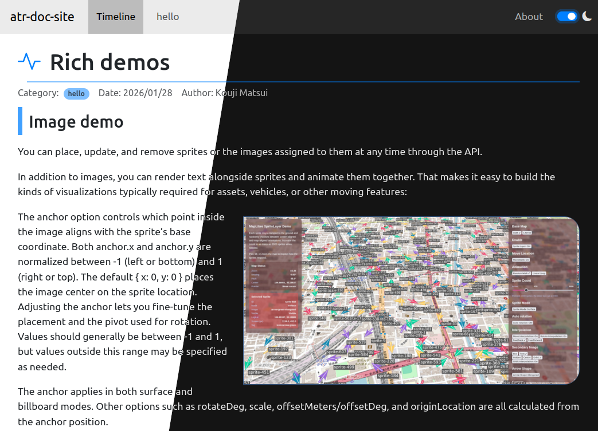

### Embedded content, cards, and graphs (Mermaid)

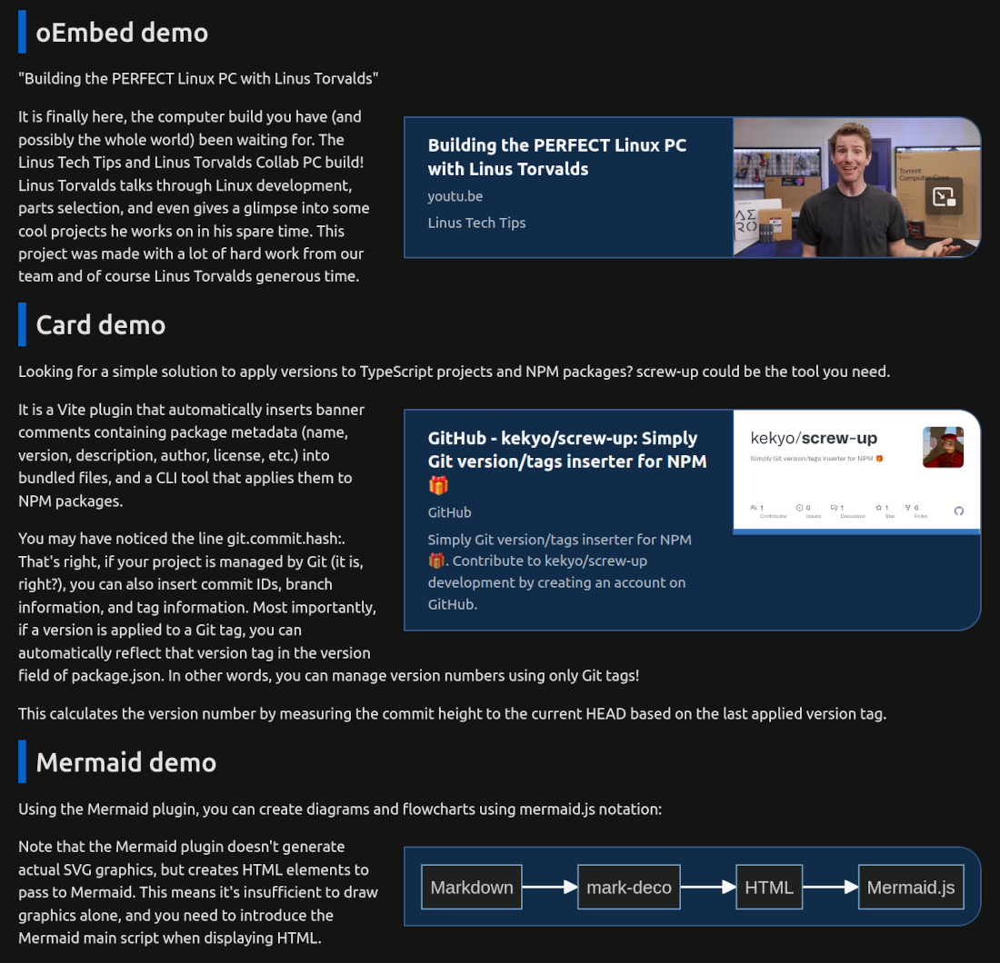

### Block quotes and syntax highlighting

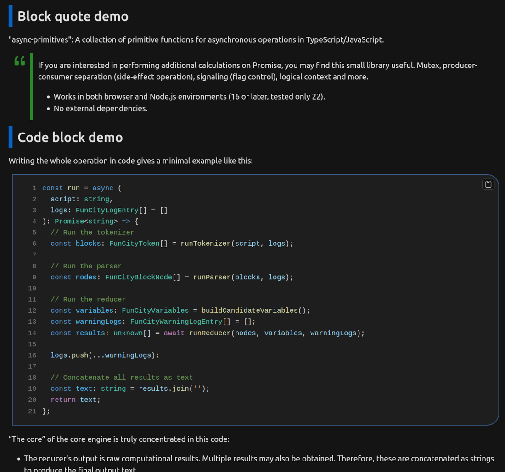

### Images and popup

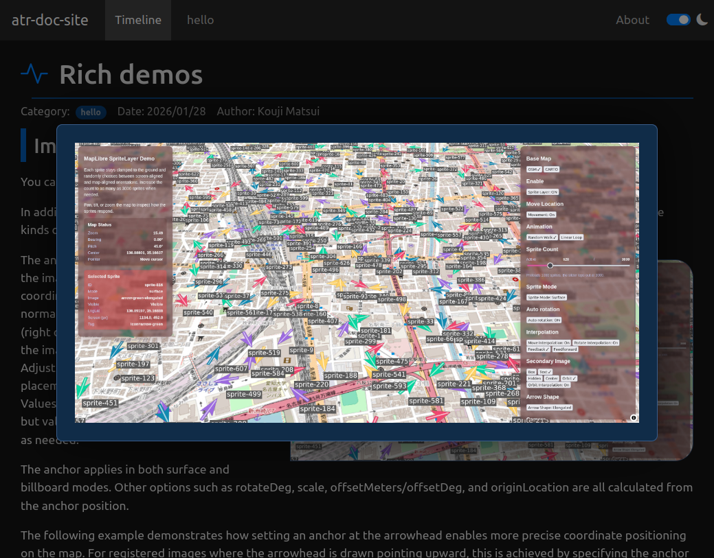

### Responsive design

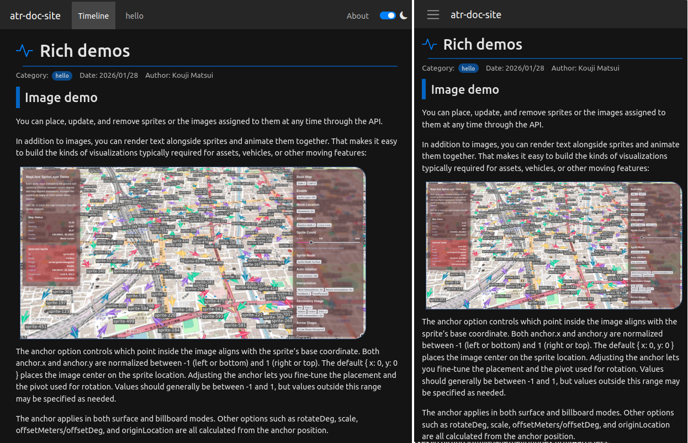

Features:

- As a static site generator, no server is required. You can deploy and publish to any web server, such as GitHub Pages.
- The timeline page also statically generates the latest documents, while older articles use infinite scroll (on-demand loading).
- Documents are written in Markdown. Markdown supports syntax highlighting for code, card display for oEmbed/OGP sources, and Mermaid rendering by default.
- HTML rendering uses [mark-deco](https://github.com/kekyo/mark-deco/), while page composition performs script-based processing via [funcity](https://github.com/kekyo/funcity/).
  Therefore, pages can be highly customized.
- With the Vite plugin, you can write documents while previewing pages in your browser.
- Document management assumes Git. Document timestamps and author information are automatically collected from Git, so manual frontmatter management is mostly unnecessary.
  Document writing management can follow standard Git workflows and is suitable for users who regularly write code.
- Since everything is built with TypeScript/NPM, you can start using it immediately as long as Node.js is installed.
- Standard support for publishing information via sitemaps, RSS, and Atom is included.
- The default template assets deliver simple, modern pages using [Bootstrap](https://getbootstrap.jp/).
  Of course, it is flexible enough to use a completely different UI framework without Bootstrap.

---

## Getting started with writing

First, install the a-terra-forge CLI (command line interface) via NPM.
If Node.js is installed on your system, you can start using it immediately.

- For example, Ubuntu often has a system Node.js installed, so you can use that. You can check with `node --version`. If it does not exist, install it with `sudo apt install nodejs`.
- In other environments, you can install from [Download Node.js](https://nodejs.org/en/download).

Then you can install the CLI with the following NPM command:

```bash
$ npm i -g a-terra-forge
```

There are two main usage patterns: using the CLI directly, and using the Vite plugin.
In either case, there is a scaffold generation feature.

- Using the CLI directly is the basic way to use a-terra-forge. There are commands to generate a new document scaffold, build the site, and refresh scaffold-managed assets.
- The Vite plugin uses [Vite](https://vite.dev/) for web development to preview the built site in a browser.
  When you save documents, the page preview updates automatically, enabling a pseudo [WYSIWYG](https://en.wikipedia.org/wiki/WYSIWYG) experience where you can always write while watching the page.

Unless there is a particular reason, it is recommended to write using the Vite plugin.
Even so, the usage is very simple, so there is no need to worry.

Writing itself can be done with a text editor/Markdown editor such as [Visual Studio Code](https://code.visualstudio.com/).
No special word processor application is required.

To write documents, you need to create a directory called an "editing space" to store your documents.
By managing this editing space with Git, you can easily implement version control for documents.

The following sections show the steps to initialize the editing space and prepare for writing.

### Initialize an editing space (using Vite)

If you use the Vite plugin, run `atr init` command to generate an editing space in the current directory:

```bash
$ mkdir my-site
$ cd my-site
$ atr init
a-terra-forge - Universal document-oriented markdown site generator
Copyright (c) Kouji Matsui (@kekyo@mi.kekyo.net)
License under MIT
https://github.com/kekyo/a-terra-forge

Scaffold created at /home/kouji/my-site
```

This creates the following files:

```
my-page
├── atr.json
├── package.json
├── vite.config.ts
├── docs
│   ├── about
│   │   ├── a-terra-forge.png
│   │   └── index.md
│   └── hello
│       ├── article-demo.md
│       ├── demo-image.jpg
│       ├── index.md
│       └── rich-demo.md
├── .gitignore
├── .assets/  ...
├── .templates/  ...
└── .github/  ...
```

The directory structure and file meanings will be explained in a separate chapter.
To use the Vite plugin, run `npm i` command once (the output may differ slightly):

```bash
$ npm i
added 306 packages, and audited 307 packages in 16s

152 packages are looking for funding
  run `npm fund` for details

found 0 vulnerabilities
```

After that, you can preview by running `npm run dev` command when you want to edit.
Your system's default web browser will open automatically to display a preview of the site:

```bash
$ npm run dev
[atr-vite] a-terra-forge - Universal document-oriented markdown site generator
[atr-vite] Copyright (c) Kouji Matsui (@kekyo@mi.kekyo.net)
[atr-vite] License under MIT
[atr-vite] https://github.com/kekyo/a-terra-forge

  VITE v7.3.1  ready in 597 ms

  ➜  Local:   http://localhost:5173/
  ➜  Network: use --host to expose
  ➜  press h + enter to show help
[atr-vite] Preparing...
[atr-vite] Render each articles [4]...
[atr-vite] renderer: entry time max=2144.04ms avg=686.66ms (4 entries)
[atr-vite] renderer: total time 2493.13ms
[atr-vite] Finalizing now...
[atr-vite] built: dist-1AuQWx/about/index.html
[atr-vite] built: dist-1AuQWx/hello/index.html
[atr-vite] built: dist-1AuQWx/index.html
[atr-vite] built: dist-1AuQWx/site-script.js
[atr-vite] built: dist-1AuQWx/sitemap.xml
[atr-vite] built: dist-1AuQWx/atom.xml
[atr-vite] built: dist-1AuQWx/feed.xml
[atr-vite] built: dist-1AuQWx/site-style.css
```

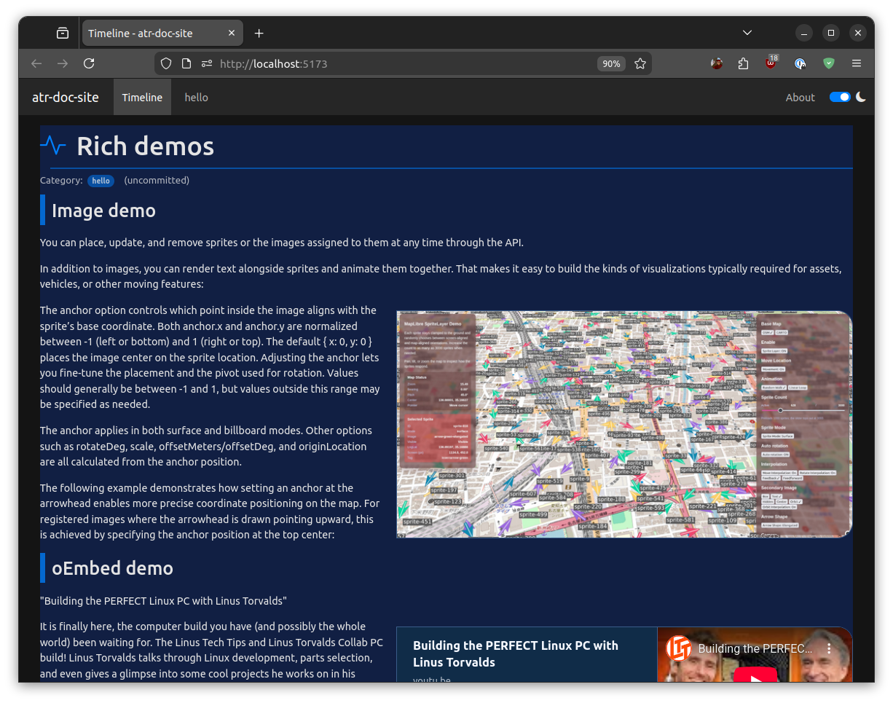

The page shown includes the scaffold's sample documents and images.
You might feel uneasy if documents already exist or everything is bright blue, but there is no need to worry.
You can quickly delete them, start writing from scratch, and adjust the appearance (At least, the accent color can be easily changed).

To build document site manually, use the following command:

```bash
$ npm run build
```

The built files are output to the `dist/` directory.
At this point, it should look like this:

```
dist/
├── about
│   ├── a-terra-forge.png
│   └── index.html
├── article-bodies
│   ├── 0.txt
│   ├── 1.txt
│   ├── 2.txt
│   └── 3.txt
├── atom.xml
├── feed.xml
├── hello
│   ├── demo-image.jpg
│   └── index.html
├── index.html
├── sitemap.xml
├── site-script.js
├── site-style.css
└── timeline.json
```

Deploy these files to a server to publish.
As you can see, feeds such as sitemaps and RSS/Atom are generated automatically.

To automatically deploy to GitHub Pages, see the section below.

### Initialize an editing space (using the CLI)

If you do not use the Vite plugin, generate the document site editing space with `atr init --no-vite` command:

```bash
$ mkdir my-site
$ cd my-site
$ atr init --no-vite
a-terra-forge - Universal document-oriented markdown site generator
Copyright (c) Kouji Matsui (@kekyo@mi.kekyo.net)
License under MIT
https://github.com/kekyo/a-terra-forge

Scaffold created at /home/kouji/my-page
```

This creates the following files:

```
my-page
├── atr.json
├── docs
│   ├── about
│   │   ├── a-terra-forge.png
│   │   └── index.md
│   └── hello
│       ├── article-demo.md
│       ├── demo-image.jpg
│       ├── index.md
│       └── rich-demo.md
├── .gitignore
├── .assets/  ...
├── .templates/  ...
└── .github/  ...
```

The directory structure and file meanings will be explained in a separate chapter.
To build the document site, use `atr build` command:

```bash
$ atr build
a-terra-forge - Universal document-oriented markdown site generator
Copyright (c) Kouji Matsui (@kekyo@mi.kekyo.net)
License under MIT
https://github.com/kekyo/a-terra-forge

Preparing...
Render each articles [4]...
renderer: entry time max=2630.03ms avg=784.29ms (4 entries)
renderer: total time 2966.43ms
Finalizing now...
built: dist/about/index.html
built: dist/hello/index.html
built: dist/index.html
built: dist/atom.xml
built: dist/feed.xml
built: dist/sitemap.xml
built: dist/site-script.js
built: dist/site-style.css
```

The built files are output to the `dist/` directory.
At this point, it should look like this (the same as when using the Vite plugin):

```
dist
├── about
│   ├── a-terra-forge.png
│   └── index.html
├── article-bodies
│   ├── 0.txt
│   ├── 1.txt
│   ├── 2.txt
│   └── 3.txt
├── atom.xml
├── feed.xml
├── hello
│   ├── demo-image.jpg
│   └── index.html
├── index.html
├── sitemap.xml
├── site-script.js
├── style.css
└── timeline.json
```

Deploy these files to a server to publish.
As you can see, feeds such as sitemaps and RSS/Atom are generated automatically.

To automatically deploy to GitHub Pages, see the section below.

---

## Managing documents

You may have experienced not liking the documents you wrote, writing several candidates and choosing one, or polishing them later.
In such cases, using Git for version control allows editing work to be flexible and safe.

For software developers, who manage source code with Git daily, this should be easy to understand.

In this chapter, we prepare to manage the editing space with Git and extend it to automatically publish the site.
Once these preparations are complete, you should have an environment that lets you focus on writing.

### Manage the editing space with Git

First, manage the editing space with Git so you can perform version control.
That way, incorrect edits, page customizations, or text you do not like can easily be reverted.

Register the current state of the editing space as the first version (commit) in Git with the following commands (`git init`, `git add -A`, `git commit ...`):

```bash
$ git init
Initialized empty Git repository in /home/kouji/my-page/.git/
$ git add -A
$ git commit -m "Initial commit"
[main (root-commit) e5fc1c0] Initial commit
 19 files changed, 2547 insertions(+)
 create mode 100644 .github/workflows/build.yml
 create mode 100644 .gitignore
 create mode 100644 atr.json
    :
    :
    :
```

Now the editing space is managed by Git.

Do you remember the preview being entirely bright blue?
In fact, a-terra-forge uses a blue background to show documents that are being edited and have not been committed to Git.

If you check after committing, you will see that the background is light (or dark).
The date and author name obtained from Git will also be displayed:

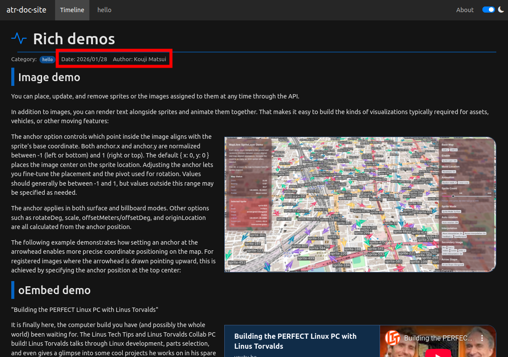

There are many explanations and books about how to use Git. Referring to them will deepen your understanding of version control.
Also, these days you can just ask ChatGPT to explain what to do.

### Publish pages fully automatically

The scaffold generated by the `atr init` command includes a [GitHub Actions](https://docs.github.com/en/actions/get-started/understand-github-actions) script:

```
├── .github
│   └── workflows
│       └── build.yml
```

If you store the editing space on GitHub, you can use this script to publish pages fully automatically.

- Note: This script can only be used when you manage versions with Git and store them on GitHub.
  It is not impossible to do the same thing in other environments, but you will need to do it yourself.
  Therefore, the following steps assume that you have registered a GitHub account and created a remote repository to store the editing space.

If you allow publishing from GitHub Actions in the GitHub Pages settings, you can deploy the site just by pushing to GitHub.

Below is an example of the GitHub Pages settings.
Click the `Settings` tab of the remote repository, then `Pages`, and select `GitHub Actions` from the dropdown list:

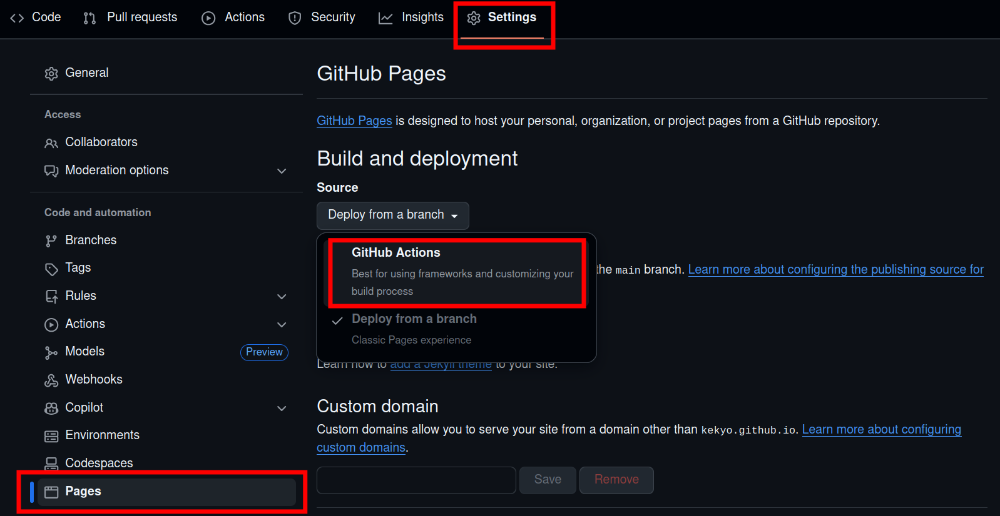

When you are ready, push your branch to the remote repository. GitHub Actions will run automatically, and the page will be published in tens of seconds to a few minutes.
The site URL should be `https://<account-name>.github.io/<repository-name>/`.

If you want to check the status of GitHub Actions, see the following page:

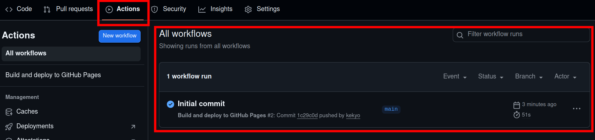

### Overall configuration of the document space

a-terra-forge manages the overall document space using a file called `atr.json`.
This file is in JSON format (strictly speaking, JSON5) and includes site-wide settings, message lists, and more.
Below is a partial excerpt of `atr.json`:

```json
{
  "version": "0.1.2",
  "variables": {
    "baseUrl": "https://atr-doc-site.github.io",
    "siteName": "atr-doc-site",
    "siteDescription": "Sample a-terra-forge site",
    "frontPage": "timeline",
    "headerIcon": "activity",
    "primaryColor": "#0080ff",
    "secondaryColor": "#40ff40",
    "inlineCodeColor": "#0080ff",
    "menuOrder": ["timeline", "hello"],
    "afterMenuOrder": ["about"]
  }
}
```

The top-level `version` is used by `atr update` to determine whether the scaffold can be refreshed. It is not part of `variables`, and it is automatically rewritten to the current atr CLI version after a successful update.

The definitions included in `variables` above are treated as "variables" and are defined so they can be referenced by a-terra-forge's internal processing and template scripts (described later). These values can be used to adjust overall site generation and appearance.

Below is an explanation of these values:

|Variable name|Details|
|:----|:----|
|`baseUrl`|Specifies the base URL where this site will be published after deployment. It does not affect the navigation menu, but it is required for sitemap generation, so be sure to set it. |
|`siteName`|The site name of this site, used for the left end of the navigation menu and for embedding page metadata.  |
|`siteDescription`|The site description, used for embedding page metadata.  |
|`frontPage`|Specifies which category to display as the site's front page (top page). The default is `timeline`, which is a special category name that shows the timeline. |
|`headerIcon`|The icon displayed in document titles. The name is specified using [Bootstrap Icons](https://icons.getbootstrap.com/). You can also specify it per document, but this value is used when omitted.|
|`primaryColor`|Specifies the primary accent color for the site. The scaffold uses many blue accents because of this setting. If you change this color, you can use your preferred accent color. However, do not forget to try colors that are well balanced between the system light and dark themes.                                     |
|`secondaryColor`|Specifies the secondary accent color for the site. The secondary color is currently used only in block quotes. |
|`inlineCodeColor`|Specifies the inline code color for the site. This is the color of text enclosed in backticks in Markdown (inline code). The background color of inline code is also colored based on this setting. |
|`menuOrder`|A list that determines the order in which recognized categories are displayed in the navigation menu. Categories not explicitly listed here are placed at the end of the list. Categories explicitly listed but not present are ignored. |
|`afterMenuOrder`|A list that determines the order in which recognized categories are displayed in the navigation menu. However, this list is displayed right-aligned in the navigation menu. Use this if you want to separate them from general categories. |

For example, changing `primaryColor` to `#ff4040` will alter the accent color as follows:

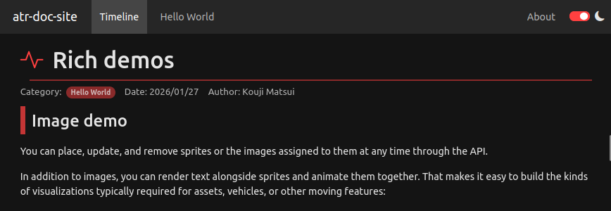

The variables above include several items for adjusting categories. These are settings based on categories, so you should check them again after referring to the categories described later.

`atr.json` still contains many predefined variables, but these will be covered in a separate chapter.

### Upgrade a-terra-forge

To upgrade the a-terra-forge CLI to the latest version, use the following NPM command:

```bash
$ npm update -g a-terra-forge
```

This will upgrade the a-terra-forge CLI itself.

After upgrading it, you may want to bring the standard files under `.assets/` and `.templates/` in your editing space up to date as well.
In that case, use the `atr update` command:

```bash
$ atr update
```

This command overwrites only scaffold-managed files under `assetsDir` and `templatesDir`. Document files such as `docs/` are not touched.

`atr update` uses the top-level `version` field in `atr.json` to determine which scaffold version your editing space currently has.

- If the editing space version is newer than the current CLI version, the update is stopped for safety.
- If `version` is missing or invalid, the update is also stopped for safety.
- Add `-f` to skip these checks and force the update.

```bash
$ atr update -f
```

When the update succeeds, the top-level `version` in `atr.json` is automatically rewritten to the current a-terra-forge CLI version string.

---

## How to write documents

Alright, let's get started writing!

"a-terra-forge" classifies documents as follows:

|Category|Details|
|:----|:----|
|General|Documents categorized by you. Examples include "Fishing," "Cooking," "Code," "DIY," etc. Documents within the same category are combined into a single page for readers. |
|Blog|Documents arranged in reverse chronological order. Each document remains independent and is not merged.|
|Timeline|A special category that automatically displays all changes from either the General or Blog categories in reverse chronological order. Only one can be placed on the site.|

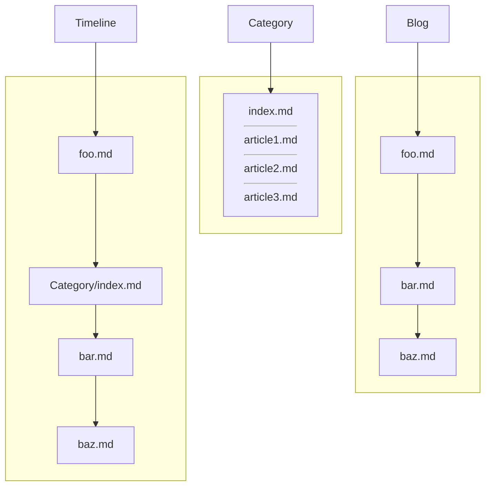
```mermaid
flowchart TB
  C[Blog]
  subgraph C_DIR[" "]
    c_foo[foo.md]
    c_bar[bar.md]
    c_baz[baz.md]
    c_foo --> c_bar --> c_baz
  end
  C --> c_foo
  B[Category]
  subgraph B_DIR[" "]
    b_index["index.md<hr/>article1.md<hr/>article2.md<hr/>article3.md"]
  end
  B --> b_index
  A[Timeline]
  subgraph A_DIR[" "]
    a_foo[foo.md]
    a_cat[Category/index.md]
    a_bar[bar.md]
    a_baz[baz.md]
    a_foo --> a_cat --> a_bar --> a_baz
  end
  A --> a_foo
```

- You can freely create as many general categories and blog categories as you like. Additionally, categories can be further subdivided into subcategories.
- "a-terra-forge" is designed with a user flow in mind: readers can follow the timeline to see the latest updates, read them, get a broader overview, or read category pages when they want to start from the beginning.
- For example, when writing about a specific topic, it's best to decide on a general category name and write it as a document within that category.
- Blog categories are suitable for writing standalone articles like "diary" or "miscellaneous notes" entries.

Categories are recognized by creating subdirectories under the `docs/` directory. For example, the following is part of the scaffold generated by `atr init`:

```
my-page
└── docs
    ├── about
    │   ├── a-terra-forge.png
    │   └── index.md
    └── hello
        ├── article-demo.md
        ├── demo-image.jpg
        ├── index.md
        └── rich-demo.md
```

The scaffold has three categories: `about`, `hello` inside `docs/`, and the timeline `timeline`.
The timeline category is special and can be generated even if it does not exist under `docs/`.

Placing files inside these category directories will make them recognized as that category.
In particular, `index.md` is always placed first in that category document. Other markdown files (`*.md`) are concatenated right after `index.md` to generate the document.

You may write all documents in `index.md`, or you may split them into multiple Markdown files.
Splitting files allows only the edited portion to appear on the timeline when you edit a file. This makes it easier for readers to see which documents were recently updated. Especially for lengthy documents, it's advisable to split chapters into separate files.

Blog categories can be created by repurposing general categories. For details, refer to a separate chapter.

### frontmatter

Documents are written in markdown, and you can add "frontmatter" at the top of the file:

```markdown
---
title: Today's cat
---

He slept behind the monitor all day. From time to time he stared vacantly out the window, and when he realized there was nothing interesting, he fell asleep again.
```

`title` represents the document title. You can specify it manually like this, but if a markdown header `# ...` exists at the beginning of the document, it is automatically converted into the title.
This frontmatter also supports other values. Using `order` lets you specify the concatenation order for articles other than `index.md` (see the scaffold's `hello` category).

Below is a list of values you can specify in frontmatter:

|Key|Details|
|:----|:----|
|`title`|Title. If omitted, it is automatically moved from the first markdown header `# ...`.|
|`id`|An ID that uniquely identifies this document. Automatically assigned.|
|`order`|An ascending number that determines the concatenation order of this document. The numbers do not have to be continuous. Note that `index.md` is always placed first.|
|`headerIcon`|The icon name shown in the leading header. Specify a Bootstrap Icons name. The default follows `atr.json`.|
|`hideMeta`|If `true`, date and author are not displayed (except on the timeline). This can be used when you want to perform rendering similar to that of a static (fixed) page.|
|`draft`|If `true`, the document is not rendered. Use this for drafts you do not want to publish.|
|`tags`|A list of tags applied to the document. There are no predefined tag names. If specified, they are set in the page's OGP metadata. This is optional.|

### Create a category

You can create a category directory yourself and start writing by placing an `index.md`, but the CLI can generate a scaffold easily:

```bash
$ atr new food
a-terra-forge - Universal document-oriented markdown site generator
Copyright (c) Kouji Matsui (@kekyo@mi.kekyo.net)
License under MIT
https://github.com/kekyo/a-terra-forge

New article created: food/index.md
```

This generates a new `docs/food/` directory and puts an `index.md` scaffold inside it.
Note that this `index.md` has `draft: true`, so it will not be included in the preview.

- If `index.md` already exists, it will be generated with a filename like `article<n>.md`.
- If a category is no longer needed, simply delete that category directory.
- You can create subcategories:
  - If a subcategory exists, you cannot place content in the parent category.
    Any existing document files in the parent category must be moved into a subcategory or an another category.
  - Further nested categories (grandchildren) are not supported.

When you create a category, a menu item is automatically added to the navigation bar:

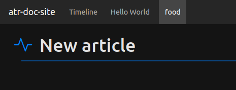

If a subcategory exists, it becomes a dropdown menu:

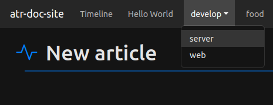

### Navigation menu

When you created a new category, you might have noticed the position of the navigation menu.
In the previous section, you were able to create `food`, `develop/server`, and `develop/web`,
but you might want to place `food` to the right of `develop`, or change the order of submenus:

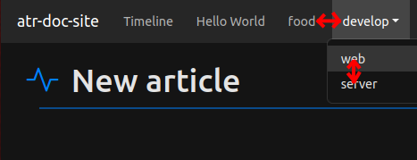

This order can be specified by the `menuOrder` variable in `atr.json`:

```json
{
  "variables": {
    "menuOrder": ["timeline", "hello", "food", "web", "server"],
  }
}
```

For `menuOrder`, specify the category directory names. Even for subcategories, do not specify the parent category name; specify only the subcategory name.
Navigation menu items are placed to keep the order specified in this list.

Note that even if you specify subcategory names as if the parent categories were split, the menu arrangement will not follow that structure, and only the order will be reflected.
In other words, the following settings yield the same result:

- `"menuOrder": ["timeline", "hello", "web", "food", "server"]`
- `"menuOrder": ["timeline", "hello", "web", "server", "food"]`

If there are categories not listed here, they are added to the end of the menu.

You might also notice that the scaffold's `about` category is placed at the far right.
If you place it on the far left, you can separate it from self-introduction and other contents:

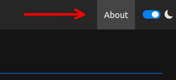

This can be specified by the `afterMenuOrder` variable:

```json
{
  "variables": {
    "afterMenuOrder": ["about"],
  }
}
```

Note that `afterMenuOrder` is always evaluated after `menuOrder`.
If a category specified in `afterMenuOrder` is included in `menuOrder`, it will be placed in the left group.

The timeline category is special, but by using the category name `timeline`, you can also adjust its position in the navigation menu.
You can deliberately place the timeline on the far right (`afterMenuOrder`) to make a site that highlights proofread documents.

### Front page and Timeline

The front page is the top page of the site. When published at a URL like `http://foobar.github.io/foobar/`, it is served as `http://foobar.github.io/foobar/index.html`.

So far, this guide has assumed that a-terra-forge always shows the timeline page as the front page,
but you can change the front page to any category. The following example changes the front page to `food`:

```json
{
  "variables": {
    "frontPage": "food",
  }
}
```

Changing the front page also changes the location of deployed asset files.

For example, when the default timeline is the front page, timeline asset files (`timeline.json`, `timeline-bodies/*`: auto-generated) are placed directly under `dist/`.
If you change the front page to `food`, the `food` asset files are placed directly under `dist/`, and the timeline is placed under `dist/timeline/`.

In other words, the URL paths visible to visitors change.
The page structure is also reflected in the sitemap, so search engine crawlers can detect the change, but frequent changes will likely incur a penalty.
(It might be putting the cart before the horse to let search engines stop you in your tracks.)

Additional Notes on the timeline:

- Specifying `timeline` in `frontPage`, omitting `frontPage`
- Or placing `timeline` anywhere in `menuOrder` or `afterMenuOrder`

Will generate a timeline page.
However, if no `timeline` specification exists, the timeline page will not be generated.

While generating the timeline page is one of a-terra-forge's distinctive features and we encourage its use,
if it is absolutely unnecessary, you can omit the timeline page in this manner.

### Message replacement

There should still be a rendering detail that hasn’t been explained yet: the names shown in the navigation bar and the category badges on the timeline:

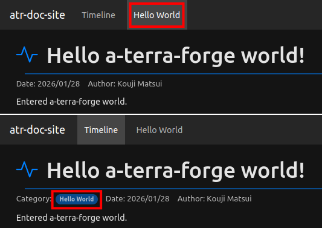

This category is placed under `docs/hello/`, but as shown above it is displayed as `Hello world`.
Up to this point, category directory names were displayed as-is.

To customize this, define the `messages` variable in `atr.json`:

```json
{
  "variables": {
    "locale": "en"
  },
  "messages": {
    "en": {
      "createdDate": "Created",
      "updatedDate": "Updated",
      "author": "Author",
      "category": "Category",
      "timeline": "Timeline",
      "hello": "Hello World",
      "about": "About",
      "endOfArticle": "End of article.",
      "noArticlesYet": "No articles yet.",
      "uncommitted": "uncommitted"
    },
    "ja": {
      "createdDate": "執筆日",
      "updatedDate": "更新日",
      "author": "執筆者",
      "category": "カテゴリ",
      "timeline": "タイムライン",
      "hello": "ハローワールド",
      "about": "About",
      "endOfArticle": "タイムラインは以上です",
      "noArticlesYet": "文書はありません",
      "uncommitted": "未コミット"
    }
  },
}
```

As you can see, the definition is split into English and Japanese, and `messages.en.hello` is set to `Hello World`. That is what you see on the screen.

- If a category name is not defined in this variable, it is rendered as the category name itself. That’s why `food` was rendered as `food`.
  Try adding a definition like `"food": "The Food"`. Don’t forget the comma.
- Directly under `messages`, you place the locale names (languages).
  In the example above, that’s `en` and `ja`, and they correspond to `variables.locale`. Since the template sets it to `en`, `messages.en.hello` is used.
- Locale names are not limited to `en` and `ja`; you can use any name you like.
  I only know Japanese and (barely) English, so the template includes just those two.
  What is your native language? Please add it here and customize it.

This `messages` mapping is used not only for resolving category names, but also for several common UI elements.
If you change `variables.locale` from `en` to `ja`, you should be able to see it:

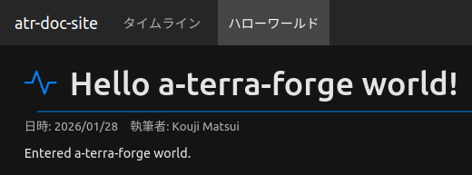

You might also prefer not to output the author’s Git signature as-is. If you add settings like this:

```json
{
  "messages": {
    "en": {
      "Kouji Matsui": "kekyo"
    },
    "ja": {
      "Kouji Matsui": "kekyo"
    }
  },
}
```

the author name can be replaced automatically:

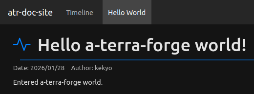

This is implemented by the `getMessage` function in the funcity script. If you want to apply `messages` to places that do not reference it in the existing template, or even in your own customized HTML, refer to “Customize templates” below.

### Blog categories

a-terra-forge also includes functionality for writing blogs.
However, since this is an optional feature, you must enable it using the following method:

- The blog feature displays posts from specified categories in a blog-like format, sorted in reverse chronological order.
- Specify the categories to use as blogs in `variables.blogCategories` within `atr.json`.
  Since this method repurposes existing categories, you can display any category (or multiple categories) as a blog.
- The blog page renders very similarly to a timeline. The latest document is statically generated, while older articles use infinite scroll (demand loading).
  Therefore, even as the blog accumulates content over time, the physical HTML size of a single page can be constrained within a certain range.
- Additionally, a separate page is generated for each individual post within the blog. These pages are embedded with appropriate OGP metadata for each document, making them useful when referenced from other sites.

Specify the category names to repurpose as blogs as follows:

```json
{
  "variables": {
    "blogCategories": ["blog"]
  },
}
```

The placement of menus within the navigation menu is determined by specifications such as `menuOrder` mentioned earlier, so the placement flexibility is the same as for regular categories.
Similar to the timeline, dynamic fragments are placed in `article-bodies/` with the `.txt` extension.

---

With this, the basic writing workflow for a-terra-forge is covered.
From here on, we will explain how to insert content other than documents.

### Insert images

To insert images in a document, just place the image in the category directory and write a Markdown image reference:

```markdown

```

The image is automatically rendered inside a frame called a "panel", positioned on the right (it takes the full width when the viewport is narrow). The text following the image wraps around it, so you can read the document while referencing the image.
When a reader clicks the image, it pops up and (if the viewport is wide enough) shows a larger view.

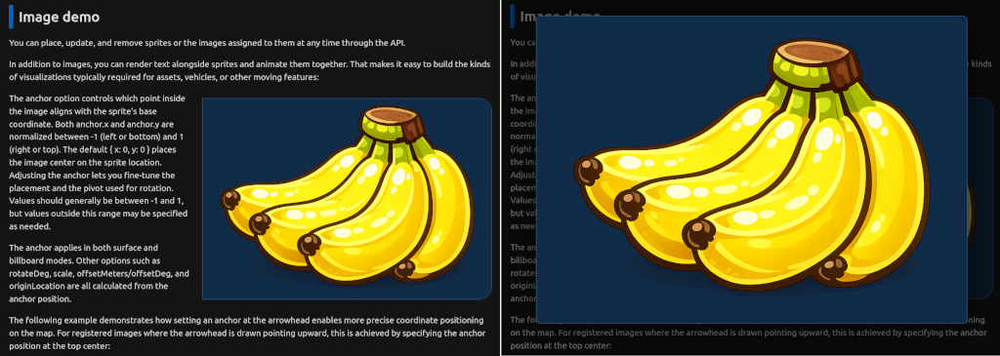

If you wrap the image in a Markdown link like this, clicking it will not zoom; it simply opens the link.

```markdown
[](https://example.com/banana/)
```

Placing and referencing images is a tedious task in many blog systems.
In a-terra-forge, that work is delegated to the editor you use.

For example, in Visual Studio Code, open the Markdown file in the editor and drag and drop an image file into it (hold Shift). The image file is copied automatically and a definition like `` is inserted:

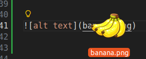

Then just tweak it a bit and the image placement is done.

### Insert code

If you write Markdown regularly, code blocks should be familiar.
They render text-file-like content in a readable way, and in Markdown you write them like this:

````markdown
```typescript
const run = async (
  script: string,
  logs: FunCityLogEntry[] = []
): Promise<string> => {
  // Run the tokenizer
  const blocks: FunCityToken[] = runTokenizer(script, logs);

  // :
  // :
  // :

  const text: string = results.join('');
  return text;
};
```
````

When you start with three backticks and an optional language label like ` ```typescript ... ``` `, everything until the next three backticks is treated as a code block. The text is then rendered like this:

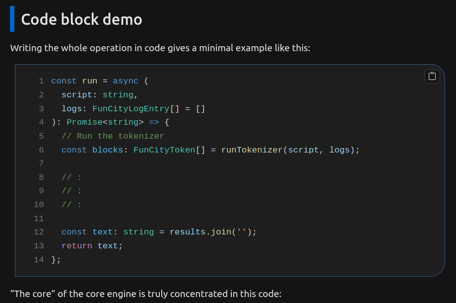

- Code blocks expand to the full viewport width. This reduces horizontal scrolling and improves readability.
- Code blocks have a copy button (top right) for copy and paste. Line numbers are not included in copied code, so it is easy to paste and run.
- Code block rendering is done with [Shiki](https://shiki.style/). See https://shiki.style/languages for supported languages.

The code block border uses the color based on `primaryColor`, but syntax highlighting follows the Shiki theme. Other Shiki settings are configured under `variables.codeHighlight` in `atr.json`:

```json
{
  "variables": {
    "codeHighlight": {
      "lineNumbers": true,
      "theme": {
        "light": "light-plus",
        "dark": "dark-plus"
      }
    }
  }
}
```

|Key|Details|
|:----|:----|
|`lineNumbers`|Show line numbers when `true`.|
|`theme`|Specifies the themes to apply. You can set different themes for light and dark. See https://shiki.style/themes for available names. Defaults are `light-plus` and `dark-plus`, similar to Visual Studio Code.|

### Insert cards

Cards are external links rendered in a style like this:


There are two main types of cards.

- oEmbed card: For links supported by an [oEmbed provider](https://oembed.com/), embedded content is shown (for example, YouTube lets you play a preview in the page), so the link becomes interactive.
- OGP card: For pages that provide [Open Graph protocol](https://ogp.me/) metadata, the link is rendered as a card using that metadata.
  a-terra-forge also uses this for pages that do not provide OGP metadata.

To show a link as a card, just use a Markdown code block with `card` and write the link:

````markdown
```card
https://youtu.be/mfv0V1SxbNA
```
````

If the specified link is supported by an oEmbed provider, it automatically tries to render it as embedded content.
Otherwise, it renders it as an OGP card.

The first example was a YouTube link, so it rendered as an oEmbed card.
The next example is a GitHub link; GitHub provides OGP metadata, so it renders as an OGP card:

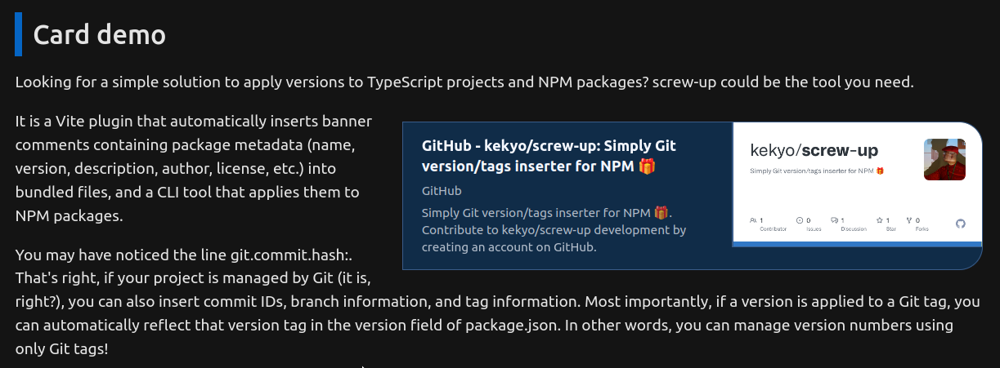

In both cases, the card is placed in a "panel" like images, and when the viewport is wide enough the text wraps around it.

Fetching oEmbed and OGP metadata is handled by [mark-deco](https://github.com/kekyo/mark-deco/). To avoid repeatedly sending the same requests for the same link, access to these providers is cached.
Cached data is stored under the `<home directory>/.cache/a-terra-forge/` directory.
If you encounter errors that won't go away, try deleting this directory.

### Insert a graph using Mermaid

With [Mermaid](https://mermaid.js.org/), you can embed diagram graphs directly in the document.
Just use a fenced code block with `mermaid` and write the diagram definition:

````markdown
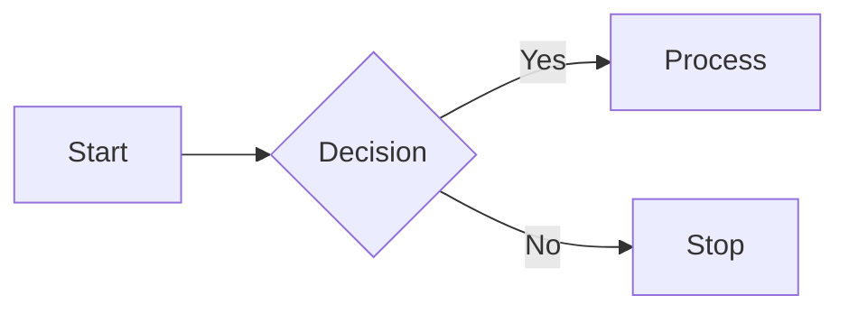
```mermaid
flowchart LR
  A[Start] --> B{Decision}
  B -->|Yes| C[Process]
  B -->|No| D[Stop]
```
````

The diagram is pre-rendered automatically during the `atr` build and displayed in the document:

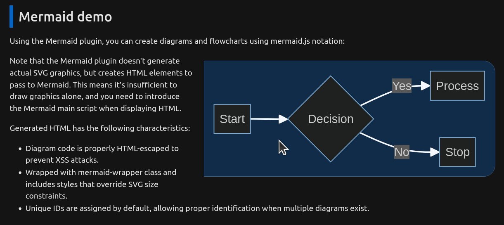

Because the definition stays as plain text, it works well with diffs and code review.
However, it may be difficult to write code without seeing how the results are displayed.

For example, using a [third-party extension for Visual Studio Code](https://marketplace.visualstudio.com/search?term=mermaid&target=VSCode&category=All%20categories&sortBy=Relevance) allows you to check and edit graph results much more quickly.

By default, a-terra-forge pre-renders Mermaid diagrams during the `atr` build with [beautiful-mermaid](https://github.com/lukilabs/beautiful-mermaid).
That means the generated page contains the rendered diagram markup already, so Mermaid's client-side runtime is not required just to display the graph.

If you prefer the legacy Mermaid.js runtime flow, set `variables.mermaidRenderer` to `mermaid`.
In that mode the template must load the Mermaid runtime script, and the default scaffold already includes it conditionally.

---

## atr.json

Below are all values defined in `atr.json` on `variables` key:

|Variable name|Template only|Details|
|:----|:----|:----|
|`version`|No|The scaffold version stored by the editing space. Place it at the top level of `atr.json`, not inside `variables`. `atr update` compares this value with the current CLI version and automatically rewrites it to the current CLI version string after a successful update. |

|Variable name|Template only|Details|
|:----|:----|:----|
|`version`|No|The scaffold version stored by the editing space. Place it at the top level of `atr.json`, not inside `variables`. `atr update` compares this value with the current CLI version and automatically rewrites it to the current CLI version string after a successful update. |
|`baseUrl`|No|Specifies the base URL where this site will be published after deployment. It does not affect the navigation menu, but it is required for sitemap generation, so be sure to set it. |
|`siteName`|No|The site name of this site, used for the left end of the navigation menu and for embedding page metadata.  |
|`siteDescription`|No|The site description, used for embedding page metadata (OGP/RSS/Atom). Images can be deployed by placing them in `assetsDir` or similar directories. |
|`siteImage`|Yes| The site image path, used for embedding page metadata (OGP). The standard size used is `1200px`x`630px`. |
|`siteIconAssetPath`|Yes|Path to the site icon asset used by the scaffold OGP SVG templates. Place the image under `assetsDir` and reference the published path such as `icon.png`. |
|`ogpImageTheme`|Yes|Theme used to select the scaffold OGP SVG templates. Accepts `light` or `dark`. Default is `light`. The scaffold looks for templates such as `og-image-light.svg` and `og-image-timeline-dark.svg`. |
|`locale`|No|The language setting for the entire site. You can also specify it per document, but this value is used when it is omitted. For example, `en` for English and `ja` for Japanese. Even if you make this selection, the content will not be automatically translated. |
|`frontPage`|No|Specifies which category to display as the site's front page (top page). The default is `timeline`, which is a special category name that shows the timeline. |
|`headerIcon`|Yes|The icon displayed in document titles. The name is specified using [Bootstrap Icons](https://icons.getbootstrap.com/). You can also specify it per document, but this value is used when omitted.|
|`primaryColor`|Yes|Specifies the primary accent color for the site. The scaffold uses many blue accents because of this setting. If you change this color, you can use your preferred accent color. However, do not forget to try colors that are well balanced between the system light and dark themes. |
|`secondaryColor`|Yes|Specifies the secondary accent color for the site. The secondary color is currently used only in block quotes. |
|`inlineCodeColor`|Yes|Specifies the inline code color for the site. This is the color of text enclosed in backticks in Markdown (inline code). The background color of inline code is also colored based on this setting. |
|`maxWidth`|Yes|Specifies the maximum width of the document area. The default is unlimited, allowing it to expand freely to match the viewport's width. If it expands too far horizontally, it can become difficult to follow lines with our eyes. Specifying a value like `90rem` can prevent this. |
|`codeHighlight`|No|Code highlight settings used by Shiki. See "Code highlighting settings" for details. |
|`siteTemplates`|No|Site-wide asset files and a group of template files that are processed with funcity scripts. CSS and JavaScript files, RSS/Atom, and sitemaps are all processed as scripts and output. If you add files that require additional script processing to this list, they will also be recognized as script processing targets.  Defaults are: `site-style.css`,`site-script.js`,`feed.xml`,`atom.xml`,`sitemap.xml`. |
|`contentFiles`|No|Specifies glob patterns for static files to copy from under `docs` during build. Use this to publish assets like images alongside generated pages. Defaults are: `./**/*.png`, `./**/*.jpg`. |
|`assetsDir`|No|Asset directory path. Default is `.assets/`. The path is resolved relative to the directory containing `atr.json`. Files under this directory are copied to `outDir` with the same structure (e.g., `.assets/favicon.ico` → `dist/favicon.ico`). |
|`docsDir`|No|Overrides the documents directory. Default is `docs/`. The path is resolved relative to the directory containing `atr.json`. |
|`templatesDir`|No|Overrides the templates directory. Default is `.templates/`. The path is resolved relative to the directory containing `atr.json`. |
|`templateNames`|No|Template directory names under `templatesDir` searched in priority order. Default is `["default"]`. For example, `["great", "default"]` first loads `.templates/great/` and falls back to `.templates/default/` for missing files. |
|`outDir`|No|Overrides the output directory. Default is `dist/`. The path is resolved relative to the directory containing `atr.json`. |
|`tmpDir`|No|Overrides the temporary working directory. Default is system temporary directory. The path is resolved relative to the directory containing `atr.json`. |
|`cacheDir`|No|Overrides the oEmbed/OGP discovery cache directory. Default is `$HOME/.cache/a-terra-forge/`. The path is resolved relative to the directory containing `atr.json`. |
|`feedSummaryLength`|No|Maximum length for RSS/Atom entry summaries. Default is `200`. |
|`feedTitle`|No|RSS/Atom feed title. Defaults to `siteName` or `"feed"` when `siteName` is empty. |
|`feedDescription`|No|RSS/Atom feed description. Defaults to `siteDescription`. |
|`prerenderCount`|No|Number of entries pre-rendered into the page. Use a positive integer; when omitted, default is `5`. |
|`menuOrder`|No|A list that determines the order in which recognized categories are displayed in the navigation menu. Categories not explicitly listed here are placed at the end of the list. Categories explicitly listed but not present are ignored. |
|`afterMenuOrder`|No|A list that determines the order in which recognized categories are displayed in the navigation menu. However, this list is displayed right-aligned in the navigation menu. Use this if you want to separate them from general categories. |
|`mermaidRenderer`|No|Selects how Mermaid diagrams are rendered. `beautiful` (default) pre-renders diagrams during the `atr` build and does not require the Mermaid runtime on the generated page. `mermaid` uses the legacy client-side Mermaid.js runtime and requires the template to load that script. |

- "Template only" means that the a-terra-forge conversion process does not use this value; it is referenced as a variable within the template assets.
- In addition to the variables shown here, you can also use the [standard variables available in funcity](https://github.com/kekyo/funcity#standard-functions).
- You can also define your own custom variable values and reference them within your funcity script.
  This is particularly useful for managing parameters like defined values centrally within your funcity script, allowing you to reuse them repeatedly.

### Code highlighting settings

`variables.codeHighlight` contains the configuration `atr.json` used for Shiki syntax highlighting.

|Key|Details|
|:----|:----|
|`lineNumbers`|Shows line numbers when `true`. |
|`theme`|Specifies the theme to apply. You can set this to a string or an object with light/dark values. |
|`theme.light`|Light theme name. |
|`theme.dark`|Dark theme name. |
|`languages`|A list of languages to register. Each entry is also added to `languageAliases` with the same name. |
|`languageAliases`|Map of language aliases (`alias`: `language`). |
|`defaultLanguage`|Default language name used when a code block omits the language label. |

---

## Customize templates

a-terra-forge renders documents according to template files and outputs HTML.
Understanding this process lets you fully customize the appearance of your document site.

When you initialize a workspace with `atr init`, a `.templates` directory like this is created:

```
my-page
├── atr.json
├── docs/  ...
├── .gitignore
├── .assets/  ...
├── .templates
│   └── default
│       ├── atom.xml
│       ├── blog-entry.html
│       ├── category-entry.html
│       ├── common-header.html
│       ├── feed.xml
│       ├── index-blog-single.html
│       ├── index-blog.html
│       ├── index-category.html
│       ├── index-timeline.html
│       ├── navigation-bar.html
│       ├── site-script.js
│       ├── site-style.css
│       ├── sitemap.xml
│       └── timeline-entry.html
└── .github/  ...
```

The scaffold's standard templates live under `.templates/default/`.
If you want themed overrides, add another directory such as `.templates/great/` and set `variables.templateNames` to `["great", "default"]`.
Files found in `great` win, and missing files fall back to `default`.

### Transformation process

All of the files shown above are interpreted as "funcity scripts".
In other words, not only `.html`, but also `.css`, `.js`, and `.xml` can use variable expansion, conditionals, and loops at build time.

The [funcity language](https://github.com/kekyo/funcity) is a text processor based on a functional language, so it enables flexible and lightweight customization.

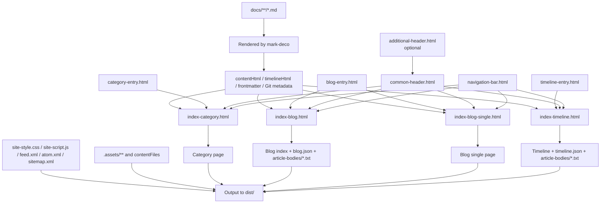
```mermaid
flowchart TD
  A[docs/**/*.md] --> B[Rendered by mark-deco]
  B --> C[contentHtml / timelineHtml / frontmatter / Git metadata]

  C --> D[index-category.html]
  C --> E[index-blog.html]
  C --> F[index-blog-single.html]
  C --> G[index-timeline.html]

  H[category-entry.html] --> D
  I[blog-entry.html] --> E
  I --> F
  J[timeline-entry.html] --> G

  K[common-header.html] --> D
  K --> E
  K --> F
  K --> G
  L[navigation-bar.html] --> D
  L --> E
  L --> F
  L --> G
  M[additional-header.html<br/>optional] --> K

  D --> N[Category page]
  E --> O[Blog index + blog.json + article-bodies/*.txt]
  F --> P[Blog single page]
  G --> Q[Timeline + timeline.json + article-bodies/*.txt]

  R[site-style.css / site-script.js / feed.xml / atom.xml / sitemap.xml] --> S[Output to dist/]
  T[.assets/** and contentFiles] --> S
  N --> S
  O --> S
  P --> S
  Q --> S
```

Roughly speaking, the build proceeds in this order:

1. `docs/**/*.md` is rendered by mark-deco, producing HTML fragments, frontmatter, and Git metadata.
2. Those results are passed to `index-category.html`, `index-blog.html`, `index-blog-single.html`, and `index-timeline.html` to assemble full pages.
3. When needed, `category-entry.html`, `blog-entry.html`, and `timeline-entry.html` are used to decorate each entry fragment.
4. `site-style.css`, `site-script.js`, `feed.xml`, `atom.xml`, and `sitemap.xml` are rendered separately as site templates.
5. Files under `.assets/` and static files matched by `contentFiles` are copied directly to the output directory.

Use `include` and `tryInclude` to split and reuse templates.
Both are resolved relative to the calling template, and nested includes are supported.

- `include 'partial.html'`: The target file is required. If it does not exist, the build fails.
- `tryInclude 'partial.html'`: If the target file does not exist, it is treated as an empty string. This is suitable for optional files such as `additional-header.html`.
- Circular includes are detected and reported as build errors.
- For compatibility, `import` and `tryImport` are still available as aliases of `include` and `tryInclude`.

The role of each file is shown below:

#### HTML generation

|File|Type|Details|
|:----|:----|:----|
|`index-category.html`|Category|Generates the full HTML for a regular category page.|
|`category-entry.html`|Category|Decorates each document entry inside a category page. If omitted, the document HTML is embedded as-is.|
|`index-blog.html`|Blog|Generates the index page for a blog category.|
|`blog-entry.html`|Blog|Generates individual document entries used by the blog index and blog single pages.|
|`index-blog-single.html`|Blog|Generates a single-document page for a blog entry.|
|`index-timeline.html`|Timeline|Generates the timeline page.|
|`timeline-entry.html`|Timeline|Generates each individual document entry on the timeline page.|
|`common-header.html`|Shared|Generates the HTML head section shared by all pages.|
|`navigation-bar.html`|Navigation menu|Generates the navigation bar at the top of the page.|
|`additional-header.html`|Shared|If present, inserts extra content into the HTML head. This is useful for analytics scripts and similar additions.|

- `additional-header.html` is optional.
- If blog categories are enabled, `index-blog.html`, `blog-entry.html`, and `index-blog-single.html` are required.
- If the timeline is generated, `index-timeline.html` and `timeline-entry.html` are required.

#### Scripts/CSS

|File|Details|
|:----|:----|
|`site-script.js`|Generates the shared JavaScript used by the site.|
|`site-style.css`|Generates the shared CSS used by the site.|

#### `.assets` directory

`.assets/` is the static asset directory copied into `outDir` as-is during the build.
Put files here when they do not need funcity processing, such as images, favicons, or icons referenced from OGP templates.
The directory structure is preserved, so for example `.assets/images/logo.png` is published as `dist/images/logo.png`.

The standard assets generated by `atr init` include `.assets/favicon.ico` and `.assets/icon.png`.
`.assets/icon.png` is used as the icon inserted into the OPG template.

The default scaffold expects `.assets/` to hold things like:

- favicons and fixed images referenced from `common-header.html` or other templates
- a fixed image referenced by `variables.siteImage`
- an icon image referenced from OGP SVG templates through `variables.siteIconAssetPath`

When you reference these files from SVG or HTML templates, treat them as published paths, for example `{{toRelativePath 'icon.png'}}` or `{{toRelativePath siteIconAssetPath}}`.

#### OGP image generation

a-terra-forge can also generate OGP PNG images during the build, separate from page HTML.
It renders dedicated SVG templates as funcity scripts, then converts the result to PNG files.
The default scaffold includes the following theme-specific templates:

|File|Details|
|:----|:----|
|`og-image-light.svg`|Light theme OGP image template for regular pages.|
|`og-image-dark.svg`|Dark theme OGP image template for regular pages.|
|`og-image-timeline-light.svg`|Light theme OGP image template for timeline pages.|
|`og-image-timeline-dark.svg`|Dark theme OGP image template for timeline pages.|

Template selection follows `variables.ogpImageTheme`.
When it is `light`, `*-light.svg` is used. When it is `dark`, `*-dark.svg` is used. When omitted or invalid, it falls back to `light`.

Templates can also be split by page mode. The lookup order is:

1. `og-image-{entryMode}-{theme}.svg`
2. `og-image-{theme}.svg`

`entryMode` is one of `category`, `blog`, `blog-single`, or `timeline`.
For example, if you want a special layout only for blog single pages, you can add `og-image-blog-single-dark.svg`.

The generated PNG file name depends on the page type:

- category pages, blog index pages, and timeline pages: `og-image.png`
- blog single pages: `{html-file-name}.og-image.png`

The relative path to the generated image is exposed to page templates as `ogImagePath`.
The default `common-header.html` uses it to emit absolute `og:image` and `twitter:image` URLs.

OGP SVG templates can use the same values as regular page templates, including `articleEntries`, `entryMode`, `variables.*` from `atr.json`, and helpers such as `formatDate`, `getMessage`, and `toRelativePath`.
That means you can compute `pageTitle` or `pageDescription` inside the SVG template itself, just like the default scaffold does.

If you want to embed static images such as a site icon into the SVG, place the file under `.assets/` and set `variables.siteIconAssetPath` to the published path.
Inside the template, reference it with `{{toRelativePath siteIconAssetPath}}`.

For example, in `atr.json`:

```json
{
  "variables": {
    "siteIconAssetPath": "icon.png",
    "ogpImageTheme": "dark"
  }
}
```

#### Metadata generation

|File|Details|
|:----|:----|
|`atom.xml`|Generates an Atom feed.|
|`feed.xml`|Generates an RSS feed.|
|`sitemap.xml`|Generates a Google sitemap.|

### FunCity variables

Every template file is rendered as a funcity script, and several variables are available inside those scripts.
These variables play an important role in a-terra-forge and form the core of document site generation.

For example, `pageTitle` is a variable representing the page title.
You can reference it with `{{ ... }}` like this to generate titles and metadata
(this is what `common-header.html` and the page templates actually do):

```html
<title>{{pageTitle}}</title>
<meta property="og:title" content="{{pageTitle}}">
```

Similarly, `articleEntries` holds a list of document entries, so you can iterate over it with `for` to render each document:

```html
<div>
{{
  for articleEntry articleEntries
    getEntry articleEntry   // Generate one document with getEntry
  end
}}
</div>
```

funcity also provides many [standard variables and functions](https://github.com/kekyo/funcity#standard-functions), and of course you can use those too.

#### Variables available in page templates

The following variables are available in `index-category.html`, `index-blog.html`, `index-blog-single.html`, and `index-timeline.html`.

|Variable name|Details|
|:----|:----|
|`articleEntries`|A list of document entries to display. The structure of each item is described in "Article entries" below.|
|`entryMode`|One of `category`, `blog`, `blog-single`, or `timeline`. You can use this for conditional branches in templates.|
|`ogImagePath`|The relative path to the generated OGP PNG for this page. It is only set when a matching OGP SVG template is available.|
|`getEntry entry`|Returns the HTML for one entry. It resolves `entry.entryHtml` and `entry.entryPath`, so list templates do not need to care about where the actual content lives.|
|`navItems`|The left-side navigation items. Each item has `label`, `href`, `isActive`, and optionally `children`.|
|`navItemsAfter`|The right-aligned navigation items. Available when `afterMenuOrder` is not empty.|
|`getSiteTemplatePath name`|Returns the relative path to the rendered output of a site template such as `site-style.css`.|
|`prerenderCount`|Available in `index-blog.html` and `index-timeline.html`. Controls how many entries are embedded initially.|
|`blogIndexPath`|Available in `index-blog.html`. The relative path to `blog.json`.|
|`blogCount`|Available in `index-blog.html`. The total number of blog entries.|
|`timelineIndexPath`|Available in `index-timeline.html`. The relative path to `timeline.json`.|
|`timelineCount`|Available in `index-timeline.html`. The total number of timeline entries.|
|`categoryCommitKeyWithDirty`|Available in `index-category.html`. A revision identifier generated from the Git state of the category as a whole.|

- In `index-category.html`, the frontmatter of the first document is also merged into the top-level variables. The default template uses this for `hideMeta`.
- In `index-blog.html` and `index-timeline.html`, page-level `title`, `description`, and `date` values are provided separately.
- In `index-blog-single.html`, the variables of the single displayed entry are also merged into the top level, so you can reference `title` and `contentHtml` directly.

#### Article entries

The following are the main variables available on each element of `articleEntries`, and inside `category-entry.html`, `blog-entry.html`, and `timeline-entry.html`.

|Variable name|Details|
|:----|:----|
|`title`|The document title.|
|`id`|The numeric ID that identifies the document. When present, the default templates also use it for an anchor like `article-<id>`.|
|`fileName`|The original Markdown file name.|
|`filePath`|The relative path from `docs/`.|
|`directory`|The category directory the document belongs to.|
|`anchorId`|The anchor ID for this document.|
|`git`|Git metadata for the document. Top-level fields such as `git.author.name`, `git.committer.date`, and `git.dirty` still refer to the latest update. You can also reference `git.created.committer.date` and `git.updated.committer.date`.|
|`date`|A date string, primarily a shorthand for the latest update time (`git.committer.date`).|
|`contentHtml`|The main body HTML. This is the full document body for category pages and single pages.|
|`timelineHtml`|A shortened HTML body intended for timeline rendering.|
|`entryHtml`|The HTML after the entry template has been applied.|
|`entryPath`|A relative path to a lazy-loaded fragment file such as `article-bodies/*.txt`.|
|`entrySinglePath`|A relative path to the single page for a blog entry. Used for blog categories and timeline items that point to those entries.|
|`category`|The category name. Combined with `getMessage category`, you can resolve a display label.|
|`categoryPath`|The relative path to the category page.|
|`index`|Available only in `category-entry.html`. The display order within the category page.|

- Keys and values written in frontmatter are also merged directly into the entry variables. For example, you can reference `description`, `tags`, `headerIcon`, `hideMeta`, or your own custom keys.
- If `locale` is specified per document, that value is used. Otherwise, it falls back to `variables.locale` in `atr.json`.
- The ordering of timeline and blog entries is decided by the build process before templating. In most cases, templates should just render the entries in the order received.

#### Variables available in site templates

In `site-style.css`, `site-script.js`, `feed.xml`, `atom.xml`, `sitemap.xml`, and any template added to `variables.siteTemplates`, the following variables are available in addition to the shared ones.

|Variable name|Details|
|:----|:----|
|`feedTitle`|The feed title. If `feedTitle` is not set, it falls back to `siteName`, or to `"feed"` if that is empty.|
|`feedDescription`|The feed description. If `feedDescription` is not set, it falls back to `siteDescription`.|
|`feedLanguage`|The feed language. Normally resolved from `locale`.|
|`siteLink`|The absolute URL of the site top page.|
|`rssLink`|The absolute URL of the RSS feed (`feed.xml`).|
|`atomLink`|The absolute URL of the Atom feed (`atom.xml`).|
|`feedUpdatedRfc1123`|The most recent update time as an RFC 1123 string.|
|`feedUpdatedIso`|The most recent update time as an ISO 8601 string.|
|`feedEntries`|A list of feed items. Each item has `title`, `link`, `date`, `dateRfc1123`, and `summary`.|
|`sitemapUrls`|A list of URLs available in `sitemap.xml`.|

- `feedEntries` and `sitemapUrls` only have meaning when the corresponding templates are included in `siteTemplates`.
- Even when you add your own site template, you can still use `variables.*` from `atr.json` and the shared helper functions.

#### Variables and functions available in all templates

|Variable name / function name|Details|
|:----|:----|
|`variables.*` from `atr.json`|Configured values such as `baseUrl` and `siteName` are available directly.|
|`version`|The a-terra-forge version string.|
|`git_commit_hash`|The commit hash of a-terra-forge itself.|
|`formatDate format value`|Formats a date/time value using `dayjs`. Example: `formatDate 'YYYY/MM/DD' git.updated.committer.date`|
|`getMessage key defaultValue?`|Resolves text using `messages` and the current `locale`. If not defined, it falls back to `defaultValue`, or to `key` itself if `defaultValue` is omitted.|
|`escapeXml value`|Escapes a string for XML or HTML attributes. Useful for feeds and sitemaps.|
|`toCssRgb value fallback`|Normalizes a color value into `r, g, b` format. Intended for use in `site-style.css`.|
|`toRelativePath path`|Returns a path relative to the file currently being generated. This helps keep links correct even if `frontPage` changes.|
|`toAbsolutePath path`|Returns an absolute URL based on `baseUrl`. Useful for OGP metadata and feeds.|
|`include 'file'`|Includes another template and evaluates the funcity script inside it too.|
|`tryInclude 'file'`|Includes an optional template. If it does not exist, it becomes an empty string.|
|`import 'file'`|A compatibility alias of `include 'file'`.|
|`tryImport 'file'`|A compatibility alias of `tryInclude 'file'`.|
|`headerIconCode`|The Bootstrap Icons code point resolved from `headerIcon`. The default templates use it for heading icons.|

- `site-style.css` and `site-script.js` are also funcity scripts, so you can use the same helper functions there.
- `toRelativePath` and `toAbsolutePath` are resolved per output file. This is safer than hard-coding paths like `/foo/bar`.

#### Common customization examples

1. If you want to inject analytics tags or extra meta tags into `<head>`, create `.templates/default/additional-header.html` or `.templates/great/additional-header.html` and let `common-header.html` include it via `tryInclude`.
2. If you want to split existing templates, create partial templates such as `.templates/default/parts/*.html` or `.templates/great/parts/*.html` and load them with `{{include 'parts/foo.html'}}`.
3. If you want to apply localization inside your own added HTML, call `{{getMessage 'contact' 'Contact'}}` or `{{getMessage category}}` explicitly.
4. If you want to output `robots.txt` or similar files, add them to `variables.siteTemplates` in `atr.json` and create `.templates/default/robots.txt` or the first themed directory from `templateNames` as a funcity script.

For example, to add `robots.txt`, you can write:

```json
{
  "variables": {
    "templateNames": [
      "default"
    ],
    "siteTemplates": [
      "site-style.css",
      "site-script.js",
      "feed.xml",
      "atom.xml",
      "sitemap.xml",
      "robots.txt"
    ]
  }
}
```

Create the template file at `.templates/default/robots.txt` or under the first directory listed in `templateNames`.

```txt
User-agent: *
Allow: /
Sitemap: {{toAbsolutePath 'sitemap.xml'}}
```

In this way, template customization in a-terra-forge is not limited to "tweaking some HTML".
It is a single funcity-based mechanism that also covers CSS, JavaScript, XML, and plain text output.
To understand the overall structure, start by reading `common-header.html` and `navigation-bar.html`, then `index-category.html` and `site-style.css`.

---

## Other

The initial idea for this generator dates back about 10 years, and [I once tried to realize it in .NET](https://github.com/kekyo/MarkTheRipper/), but various (non-software) issues piled up and it was left abandoned.
Now, I rewrote it in TypeScript, and it has finally taken shape. I believe I've refined several lessons learned from the .NET implementation and produced a solid result.

Soon, I will replace my blog site from WordPress to a-terra-forge and dogfood it.

[So, what exactly is "a-terra-forge"? (in japanese)](<https://ja.wikipedia.org/wiki/%E9%98%BF%E5%AF%BA%E5%B7%9D_(%E9%95%B7%E9%87%8E%E7%9C%8C)>) Well, it's mostly an afterthought ;)

## License

Under MIT.
