# a-terra-forge

汎用的なmarkdownドキュメントサイトジェネレータ


[](https://www.repostatus.org/#wip)
[](https://opensource.org/licenses/MIT)
[](https://www.npmjs.com/package/a-terra-forge)

---

[(English language is here)](./README.md)

TODO: WIP

## これは何?

ある程度整理されたドキュメントを、少しずつ執筆したいと感じたことはありませんか？
一般的なブログシステムは管理が大変で、簡易なブログジェネレータもあくまで「ブログ」を執筆することが主目的のため、文書にまとまりが無く読み手にスムーズに文書を読んでもらうことが難しくなります。

"a-terra-forge" (あてらふぉーじ) は、文書をカテゴリでまとめて表示させることができて、かつ、執筆中の文書をタイムラインページで時系列で追うことが出来る、ドキュメントサイトジェネレータです。
サイトは完全にスタティックビルドされるので、サーバーコードは不要です。
文書はmarkdownで書くことが出来て、以下のようなリッチ表現の機能もあります:

### ライト・ダークテーマ


### 埋め込みコンテンツ・カード・グラフ図(mermaid)

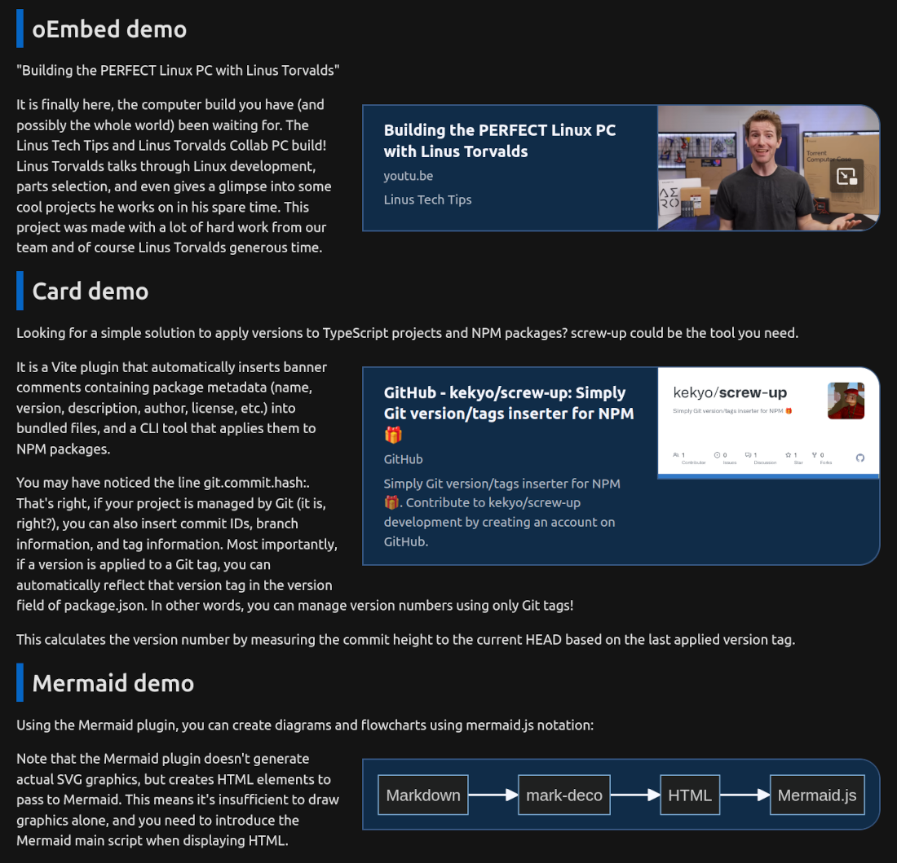

### ブロッククオートとシンタックスハイライト

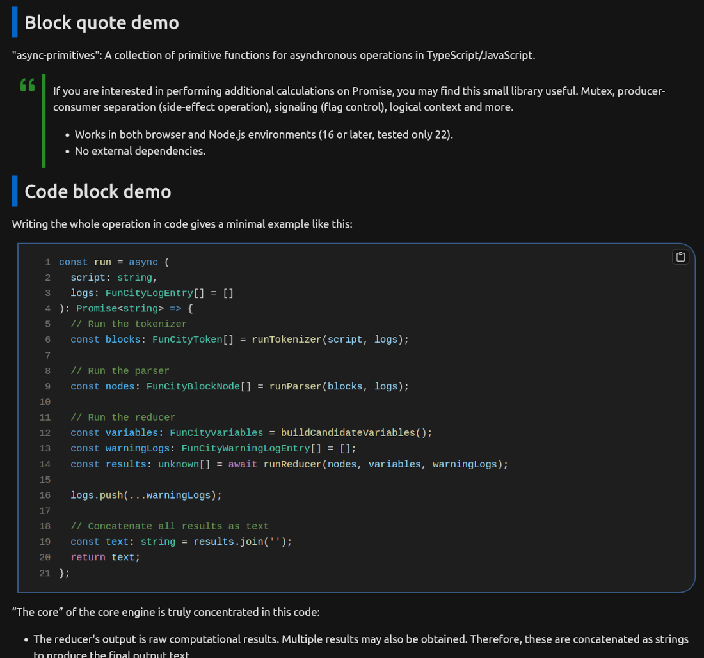

### 画像とポップアップ

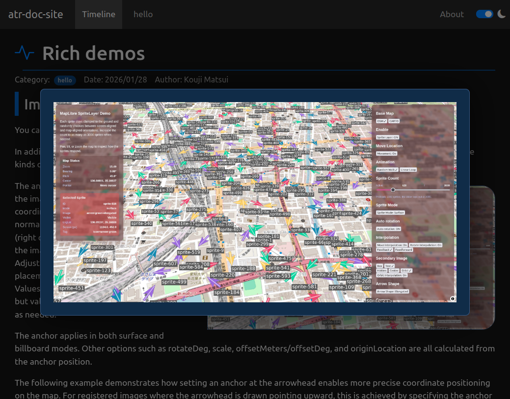

### レスポンシブデザイン

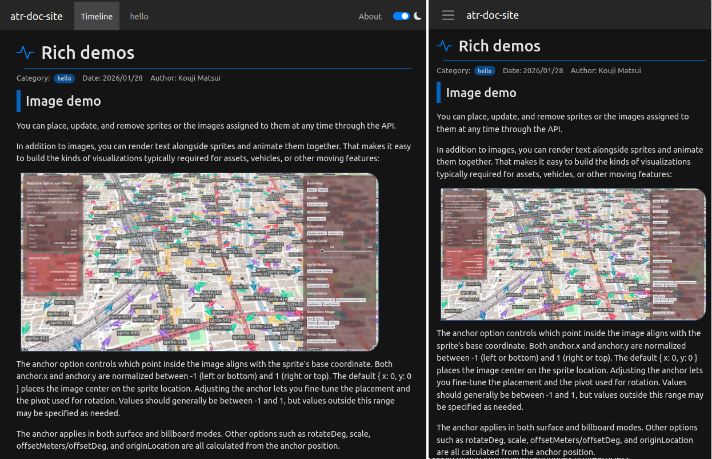

以下のような特徴があります:

- スタティックサイトジェネレータなので、サーバーは不要です。GitHub Pagesなど、任意のウェブサーバーにデプロイして公開できます。
- タイムラインページも最新の文書はスタティック生成され、古い記事は無限スクロール（デマンド読み込み）が行われます。
- 文書はmarkdownで記述します。markdownは、コードのシンタックスハイライト・oEmbed/OGPソースのカード表示・mermaidのレンダリングを標準でサポートしています。
- HTMLレンダリングは [mark-deco](https://github.com/kekyo/mark-deco/) を使用し、ページの構成は [funcity](https://github.com/kekyo/funcity/) でスクリプトによるプロセッシングを行います。
  したがって、ページの高いカスタマイズ性があります。
- Viteプラグインを使って、ブラウザでページのプレビューを見ながら文書を執筆することが出来ます。
- 文書の管理はGitを使うことを前提としています。文書の日時や執筆者情報もGitから自動的に収集するため、frontmatterでの手動の管理はほとんど必要ありません。
  文書執筆の管理も、通常のGit運用を前提で行えばよく、日常的にコードを記述するユーザーに向いています。
- すべてTypeScript/NPMで作られているため、Node.jsがインストールされていればすぐに使い始めることが出来ます。
- サイトマップ・RSS・Atomによる情報公開に標準で対応しています。
- 標準のテンプレートアセットは、[bootstrap](https://getbootstrap.jp/) によるシンプルでモダンなページを実現しています。
  もちろん、bootstrapを使わず、全く別のUIフレームワークを使用することも不可能ではない柔軟性があります。
- ブログを同時に収容出来ます（カテゴリのブログ転用）

---

## 執筆開始

まずは、NPMでa-terra-forgeのCLI（コマンドラインインターフェイス）をインストールします。
システムにNode.jsがインストールされていれば、すぐに使用を始めることが出来ます。

- 例えば、Ubuntuにはシステム用Node.jsがインストールされていることが多いので、これを使うことが出来ます。`node --version`で確かめることが出来ます。存在しない場合は `sudo apt install nodejs` でインストールできます。
- 他の環境でも、[Node.jsをダウンロードする](https://nodejs.org/ja/download) からインストールできます。

その後、以下のNPMコマンドで、CLIをインストールできます:

```bash
$ npm i -g a-terra-forge
```

使用方法は大きく2通りあります。CLIを直接使用する方法と、Viteプラグインを使用する方法です。
どちらの場合も、雛形を生成（スキャフォールディング）する機能があります。

- CLIを直接使用する方法は、a-terra-forgeの基本的な使用方法です。新規に文書の雛形を生成するコマンドと、サイトをビルドするコマンドがあります。
- Viteプラグインとは、ウェブ開発向けの [Vite](https://ja.vite.dev/) を使用して、ブラウザでビルドされたサイトをプレビューできるようにするものです。
  文書を保存すると、自動的にページのプレビューが更新されるので、常にページの表示を見ながら執筆ができるという、擬似的な [WYSIWYG](https://ja.wikipedia.org/wiki/WYSIWYG) が実現出来ます。

特に理由がなければ、Viteプラグインを使用して執筆すると良いと思います。
と言っても、使用方法は非常に簡単なので、恐れる必要はありません。

執筆自体は、 [Visual Studio Code](https://code.visualstudio.com/) などのテキストエディタ/markdownエディタを使用して執筆出来ます。
特別なワードプロセッサアプリケーションなどは不要です。

文書を執筆するには、文書を格納する「編集スペース」と呼ばれるディレクトリを作っておく必要があります。
この編集スペースをGitで管理することで、文書のバージョン管理も容易に実現出来ます。

以下の節では、編集スペースを初期化して、文書執筆の準備を行う手順を示します。

### 編集スペースを初期化 (Viteを使用する)

Viteプラグインを使用する場合は、以下のコマンドで現在のディレクトリに編集スペースを生成します:

```bash
$ mkdir my-site
$ cd my-site
$ atr init
a-terra-forge - Universal document-oriented markdown site generator
Copyright (c) Kouji Matsui (@kekyo@mi.kekyo.net)
License under MIT
https://github.com/kekyo/a-terra-forge

Scaffold created at /home/kouji/my-site
```

これにより、以下のようなファイル群が生成されます:

```
my-page
├── atr.json
├── dist
├── docs
│   ├── about
│   │   ├── a-terra-forge.png
│   │   └── index.md
│   └── hello
│       ├── article-demo.md
│       ├── demo-image.jpg
│       ├── index.md
│       └── rich-demo.md
├── package.json
├── templates
│   ├── atom.xml
│   ├── blog-entry.html
│   ├── category-entry.html
│   ├── feed.xml
│   ├── index-blog.html
│   ├── index-category.html
│   ├── index-timeline.html
│   ├── navigation-bar.html
│   ├── sitemap.xml
│   ├── site-script.js
│   ├── site-style.css
│   └── timeline-entry.html
├── vite.config.ts
├── .github
│   └── workflows
│       └── build.yml
└── .gitignore
```

Viteプラグインを使うには、以下のコマンドを最初の一度だけ実行します（表示される内容は多少異なる場合があります）:

```bash
$ npm i
added 306 packages, and audited 307 packages in 16s

152 packages are looking for funding
  run `npm fund` for details

found 0 vulnerabilities
```

その後は、編集したい時に以下のコマンドでプレビューできるようにします。
システム標準のウェブブラウザが自動的に開き、サイトのプレビューが表示されます:

```bash
$ npm run dev
[atr-vite] a-terra-forge - Universal document-oriented markdown site generator
[atr-vite] Copyright (c) Kouji Matsui (@kekyo@mi.kekyo.net)
[atr-vite] License under MIT
[atr-vite] https://github.com/kekyo/a-terra-forge

  VITE v7.3.1  ready in 597 ms

  ➜  Local:   http://localhost:5173/
  ➜  Network: use --host to expose
  ➜  press h + enter to show help
[atr-vite] Preparing...
[atr-vite] Render each articles [4]...
[atr-vite] renderer: entry time max=2144.04ms avg=686.66ms (4 entries)
[atr-vite] renderer: total time 2493.13ms
[atr-vite] Finalizing now...
[atr-vite] built: dist/about/index.html
[atr-vite] built: dist/hello/index.html
[atr-vite] built: dist/index.html
[atr-vite] built: dist/site-script.js
[atr-vite] built: dist/sitemap.xml
[atr-vite] built: dist/atom.xml
[atr-vite] built: dist/feed.xml
[atr-vite] built: dist/site-style.css
```

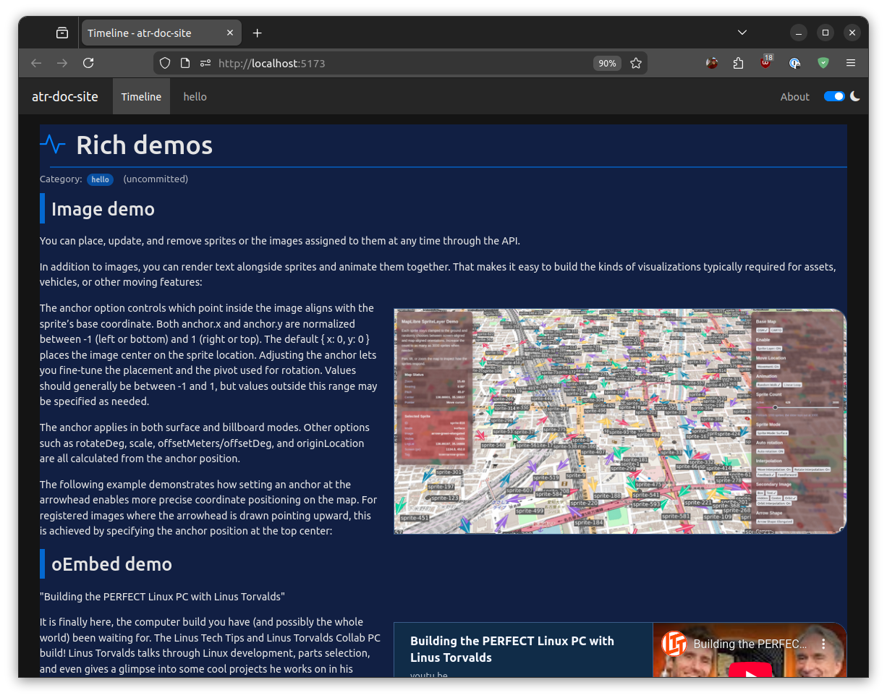

今表示されたページは、雛形のサンプル文書や画像などが表示されています。
すでに文書が書かれていたり、全体的に真っ青だったりと不安を感じるかもしれませんが、もちろん心配無用です。
これらをサクッと削除して、一から文書を書き始め、見た目も調整することが出来ます（少なくとも、アクセントカラーは簡単に変えられます）。

プレビューが表示された時点で、ドキュメントサイトはビルドされていますが、手動でビルドする場合は、以下のコマンドを使用します:

```bash
$ npm run build
```

ビルドされたファイルは、 `dist/` ディレクトリに出力されます。
この時点では、以下のようになっているでしょう:

```
dist/
├── about
│   ├── a-terra-forge.png
│   └── index.html
├── article-bodies
│   ├── 0.html
│   ├── 1.html
│   ├── 2.html
│   └── 3.html
├── atom.xml
├── feed.xml
├── hello
│   ├── demo-image.jpg
│   └── index.html
├── index.html
├── sitemap.xml
├── site-script.js
├── site-style.css
└── timeline.json
```

これらのファイルをサーバーにデプロイすれば公開完了です。
見ての通り、サイトマップやRSS/Atomなどのフィードディスクリプタも自動的に生成されます。

GitHub Pagesなどに自動でデプロイさせるには、後述の節を参照してください。

### 編集スペースを初期化 (CLIを使用する)

Viteプラグインを使用しない場合は、以下のコマンドでドキュメントサイト編集スペースを生成します:

```bash
$ mkdir my-site
$ cd my-site
$ atr init --no-vite
a-terra-forge - Universal document-oriented markdown site generator
Copyright (c) Kouji Matsui (@kekyo@mi.kekyo.net)
License under MIT
https://github.com/kekyo/a-terra-forge

Scaffold created at /home/kouji/my-page
```

これにより、以下のようなファイル群が生成されます:

```
my-page
├── atr.json
├── dist
├── docs
│   ├── about
│   │   ├── a-terra-forge.png
│   │   └── index.md
│   └── hello
│       ├── article-demo.md
│       ├── demo-image.jpg
│       ├── index.md
│       └── rich-demo.md
├── templates
│   ├── atom.xml
│   ├── blog-entry.html
│   ├── category-entry.html
│   ├── feed.xml
│   ├── index-blog.html
│   ├── index-category.html
│   ├── index-timeline.html
│   ├── navigation-bar.html
│   ├── sitemap.xml
│   ├── site-script.js
│   ├── site-style.css
│   └── timeline-entry.html
├── .github
│   └── workflows
│       └── build.yml
└── .gitignore
```

ドキュメントサイトをビルドする場合は、以下のコマンドを使用します:

```bash
$ atr build
a-terra-forge - Universal document-oriented markdown site generator
Copyright (c) Kouji Matsui (@kekyo@mi.kekyo.net)
License under MIT
https://github.com/kekyo/a-terra-forge

Preparing...
Render each articles [4]...
renderer: entry time max=2630.03ms avg=784.29ms (4 entries)
renderer: total time 2966.43ms
Finalizing now...
built: dist/about/index.html
built: dist/hello/index.html
built: dist/index.html
built: dist/atom.xml
built: dist/feed.xml
built: dist/sitemap.xml
built: dist/site-script.js
built: dist/site-style.css
```

ビルドされたファイルは、 `dist/` ディレクトリに出力されます。
この時点では、以下のようになっているでしょう（Viteプラグインを使用した場合と同じはずです）:

```
dist
├── about
│   ├── a-terra-forge.png
│   └── index.html
├── article-bodies
│   ├── 0.html
│   ├── 1.html
│   ├── 2.html
│   └── 3.html
├── atom.xml
├── feed.xml
├── hello
│   ├── demo-image.jpg
│   └── index.html
├── index.html
├── sitemap.xml
├── site-script.js
├── style.css
└── timeline.json
```

これらのファイルをサーバーにデプロイすれば公開完了です。
見ての通り、サイトマップやRSS/Atomなどのフィードディスクリプタも自動的に生成されます。

GitHub Pagesなどに自動でデプロイさせるには、後述の節を参照してください。

---

## 文書の管理

あなたは、執筆した文書が気に入らないとか、いくつかの候補を書き上げてからどれかを選んだり、それらを元に清書するというステップを踏んだことがあるかもしれません。
そのような場合に、Gitのバージョン管理を使えば、編集作業が柔軟かつ安全に行えるようになります。

ソフトウェア開発者の場合は、日常的にソースコードの管理をGitで行っているでしょうから、より実感しやすい筈です。

この章では、編集スペースをGitで管理する準備と、それを応用してサイトを自動的に公開することまで行います。
これらの準備が整えば、執筆作業に集中できる環境が整うはずです。

### 編集スペースをGitで管理する

まず、編集スペースをGitに管理させて、バージョン管理できるようにしましょう。
そうすれば、誤った編集やページのカスタマイズ、気に入らない記述なども容易に元に戻せます。

以下のコマンドで、編集スペースの状態をGitの最初のバージョンとして登録（コミット）します:

```bash
$ git init
Initialized empty Git repository in /home/kouji/my-page/.git/
$ git add -A
$ git commit -m "Initial commit"
[main (root-commit) e5fc1c0] Initial commit
 19 files changed, 2547 insertions(+)
 create mode 100644 .github/workflows/build.yml
 create mode 100644 .gitignore
 create mode 100644 atr.json
    :
    :
    :
```

これで、編集スペースがGitで管理されるようになりました。

先程のプレビュー表示が全体的に真っ青だったことを覚えていますか？
実は、a-terra-forgeは、編集中でGitにコミットされていない文書が、青色の背景で分かるようにしていたのです。

コミット後に確認すれば、背景が白色（または黒色）となっていることが分かるでしょう。
また、Gitから得られた日時や執筆者名が表示されるようになります:

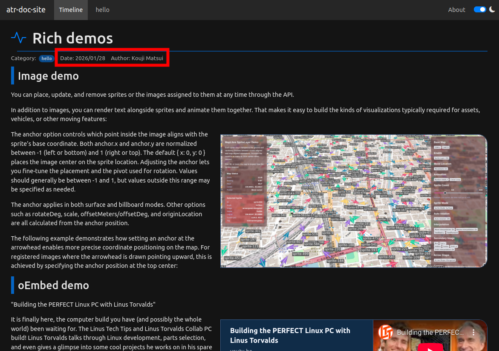

世界には、Gitに関する使い方の説明や書籍がたくさんあります。それらを参照すれば、バージョン管理の理解も深まるでしょう。
また、今ならChatGPTに聞くだけで、どうすれば良いのか説明してくれるはずです。

### 全自動でページを公開する

`atr init`コマンドで生成された雛形には、 [GitHub Actions](https://docs.github.com/ja/actions/get-started/understand-github-actions) のスクリプトが含まれています:

```
├── .github
│   └── workflows
│       └── build.yml
```

編集スペースをGitHubに保存するのであれば、このスクリプトを使用して、全自動でページを公開することが出来ます。

- 注意: このスクリプトは、バージョン管理をGitで行い、かつGitHubに保存する場合のみ使用できます。
  他の環境でも同様の事は不可能ではありませんが、その場合はご自身で作業する必要があります。
  したがって、以下の作業は、GitHubにユーザー登録を行って、編集スペースを保存するリモートリポジトリを作っていることが前提です。

予めGitHub Pagesの設定で、GitHub Actionsからの発行を許可しておけば、GitHubにpushするだけで、サイトをデプロイ出来ます。

以下は、GitHub Pagesの設定の例です。
リモートリポジトリの `Settings` タブの `Pages` をクリックし、ドロップダウンリストから `GitHub Actions` を選択します:

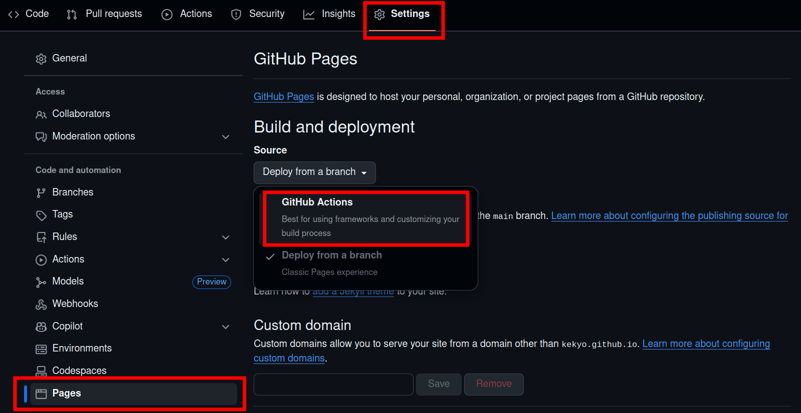

準備が出来たら、ブランチをリモートリポジトリにpushしてください。これで、自動的にGitHub Actionsが動作して、数十秒〜数分でページが公開されます。
サイトのURLは、`https://<アカウント名>.github.io/<リポジトリ名>/` となっているはずです。

GitHub Actionsの動作状況を確認したい場合は、以下のページを参照してください:

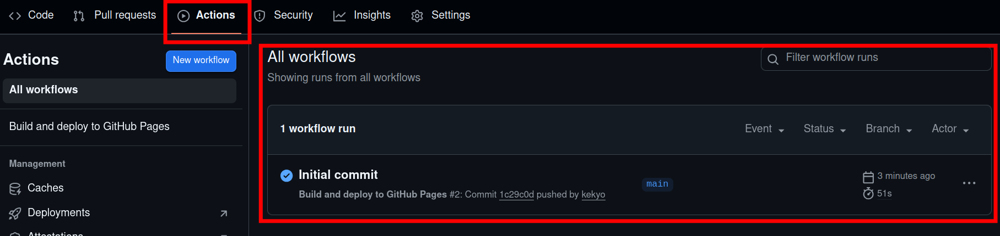

### 文書スペースの全体的な設定

a-terra-forgeは、文書スペースの全体的な管理を `atr.json` というファイルで行います。
このファイルはJSON形式（正確にはJSON5）で、サイト共通の設定や、メッセージリスト等を含みます。
以下は、 `atr.json` の一部を抜き出したものです:

```json
{
  "variables": {
    "baseUrl": "https://atr-doc-site.github.io",
    "siteName": "atr-doc-site",
    "siteDescription": "Sample a-terra-forge site",
    "frontPage": "timeline",
    "headerIcon": "activity",
    "primaryColor": "#0080ff",
    "secondaryColor": "#40ff40",
    "inlineCodeColor": "#0080ff",
    "menuOrder": ["timeline", "hello"],
    "afterMenuOrder": ["about"]
  }
}
```

上記 `variables` に含まれる定義は「変数」として扱われ、a-terra-forgeの内部処理や、テンプレートスクリプト（後述）で参照できるように定義されています。これらの値を使用して、全体的なサイト生成の調整や、見た目の変更などが行えます。

以下に、これらの値の説明を示します:

|変数名|詳細|
|:----|:----|
|`baseUrl`| このサイトのデプロイ後の公開基底URLを指定します。ナビゲーションメニューに影響はありませんが、サイトマップの生成には必要なので、設定してください。|
|`siteName`| このサイトのサイト名で、ナビゲーションメニューの左端の表示や、ページメタデータの埋め込みに使用されます。 |
|`siteDescription`| このサイトの説明文で、ページメタデータの埋め込みに使用されます。 |
|`frontPage`| サイトのフロントページ（トップページ）として、どのカテゴリを表示するかを指定します。既定は`timeline`で、これはタイムラインを表示する、特殊なカテゴリ名です。 |
|`headerIcon`| 文書のタイトルに表示するアイコンの指定です。名称は [bootstrap icons](https://icons.getbootstrap.com/) で指定します。文書にも個別に指定することが出来ますが、省略された場合にこの値が使用されます。 |
|`primaryColor`| サイトのプライマリ（優先）アクセントカラーを指定します。雛形が青色のアクセントを多用しているのはこの指定によるものです。この色を変えれば、あなたの好みのアクセントカラーに変更できます。但し、システムテーマのlightとdarkでバランスの取れている色味を試行錯誤することを忘れずに。 |
|`secondaryColor`| サイトのセカンダリ（補間）アクセントカラーを指定します。セカンダリカラーは今の所、ブロッククオートでのみ使用しています。 |
|`inlineCodeColor`| サイトのインラインコードカラーを指定します。これは、markdown上でバッククオートで囲まれた文字（インラインコード）の色です。インラインコードの背景色もこの指定から着色されます。 |
|`menuOrder`| 認識したカテゴリを、どの順序でナビゲーションメニューに表示させるのかを決定するリストです。ここに明示のないカテゴリは、これらのリストの終端に配置されます。また、個々に明示されているのに存在しないカテゴリは無視されます。 |
|`afterMenuOrder`| 認識したカテゴリを、どの順序でナビゲーションメニューに表示させるのかを決定するリストです。但し、このリストは、ナビゲーションメニューの右寄せで表示されます。一般カテゴリとは分けて置きたい場合に使用できます。 |

例えば、 `primaryColor` を `#ff4040` に変更すると、以下のようにアクセントカラーが変わります:

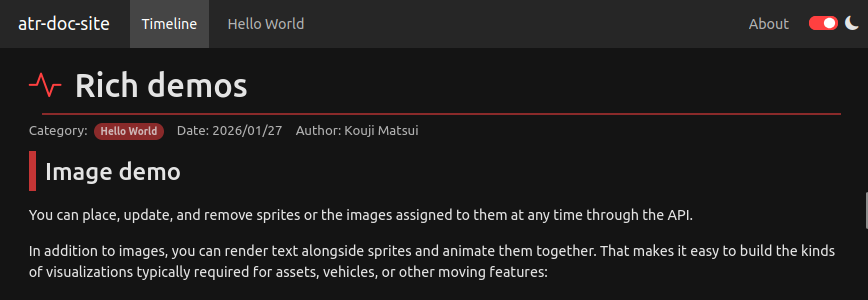

上記の変数には、カテゴリについての調整項目がいくつかあります。それらは後述のカテゴリに基づいた設定なので、そちらを参照した上で改めて確認すると良いでしょう。

`atr.json` にはまだ多くの定義済み変数がありますが、それらについては別章で示します。

---

## 文書の書き方

それでは、執筆を開始しましょう！

"a-terra-forge"は、文書をカテゴリ別に扱います。例えば、何かの資料について執筆する場合は、カテゴリ名を決めて、そのカテゴリの文書として執筆すると良いでしょう。
カテゴリは `docs/` ディレクトリの下にサブディレクトリを作ることで認識されます。例えば、以下は`atr init`で生成される雛形の一部ですが:

```
my-page
└── docs
    ├── about
    │   ├── a-terra-forge.png
    │   └── index.md
    └── hello
        ├── article-demo.md
        ├── demo-image.jpg
        ├── index.md
        └── rich-demo.md
```

雛形のカテゴリは3種類あり、 `docs/` ディレクトリ内の `about`, `hello` と、タイムライン `timeline` がカテゴリです。
タイムラインカテゴリは特殊なカテゴリで、 `docs/` に存在しなくても生成できます。

これらのカテゴリディレクトリ内にファイルを配置することで、そのカテゴリとして認識されます。
特に、`index.md` は、そのカテゴリの文書の最初に必ず配置されます。その他のmarkdownファイル(`*.md`)は、 `index.md` のすぐ後ろに結合されて文書が生成されます。

全ての文書を `index.md` に記述しても良いですし、複数のmarkdownファイルに分割して記述しても構いません。
ファイルを分割しておくと、ファイルを編集した場合にその部分だけがタイムラインに掲載されます。読者は最近どの文書が更新されたのかを把握しやすくなるため、特に長文となる場合は、章をファイル単位に分割すると良いでしょう。

### frontmatter

文書はmarkdownで記述しますが、文書ファイルの先頭には"frontmatter"（ふろんとまたー）と呼ばれる、その文書の付随データを追加出来ます:

```markdown
---
title: 今日の猫
---

今日は一日中、モニターの後ろで寝ていた。時々窓の外を虚ろな眼差しで眺め、何も面白いことがないと分かると、再び眠りに就く。
```

`title` はその文書のタイトルを表します。手動でこのように指定しても良いのですが、markdownの先頭にヘッダ `# ...` が存在すると、自動的にタイトルに変換されます。
このfrontmatterには、他にも指定可能な値があります。 `order` を使用すれば、 `index.md` 以外の記事をどの順序で結合するかを指定できます
（雛形の `hello` カテゴリを参照）。

以下にfrontmatterに指定できる値の一覧を示します:

|キー名|詳細|
|:----|:----|
|`title`|タイトル。未記入の場合に、自動的にmarkdown先頭のヘッダ`# ...`から移動される。|
|`id`|この文書を一意に識別するID番号。自動的に付与される。|
|`order`|この文書を結合する順序を決める、昇順の番号。番号は連続していなくても良い。`index.md`は常に先頭に配置されることに注意。|
|`headerIcon`|先頭のヘッダに表示するアイコンの名称。bootstrap iconsのアイコン名を指定する。デフォルトは`atr.json`の指定に従う。|
|`hideMeta`|`true`の場合に、日時や執筆者が表示されなくなる（タイムラインを除く）。固定ページのような描画を行いたい場合に使える。|
|`draft`|`true`の場合に、文書がレンダリングされなくなる。下書きで公開したくない場合に使用する。|
|`tags`|文書に適用するタグのリスト。決められたタグ名は存在しない。指定されるとページのOGPメタデータに設定される。必須ではないことに注意。|

### カテゴリを作る

自分でカテゴリディレクトリを作り、その中に `index.md` を配置して一から執筆を開始しても問題ありませんが、CLIを使えば簡単に雛形を作ることが出来ます:

```bash
$ atr new food
a-terra-forge - Universal document-oriented markdown site generator
Copyright (c) Kouji Matsui (@kekyo@mi.kekyo.net)
License under MIT
https://github.com/kekyo/a-terra-forge

New article created: food/index.md
```

これで新たに `docs/food/` ディレクトリが生成され、その中に `index.md` の雛形が配置されます。
但し、この `index.md` は `draft: true` が指定されているため、プレビューに文書が含まれないことに注意してください。

- もし、あるカテゴリがもう不要であるなら、そのカテゴリディレクトリを単純に削除すれば消えてなくなります。
- カテゴリにサブカテゴリを作ることが出来ます:
  - サブカテゴリが存在する場合は、親のカテゴリにコンテンツを配置できないことに注意してください。
    既存の親カテゴリの文書ファイルなどは、サブカテゴリまたは別のカテゴリに移動する必要があります。
  - サブカテゴリの更にネストしたカテゴリ（孫カテゴリ）はサポートされていません。

カテゴリを作ると、ナビゲーションバーに自動的にメニュー項目が追加されます:

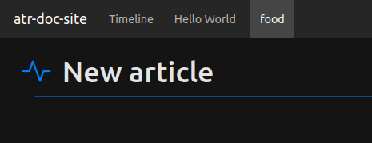

また、サブカテゴリがある場合は、ドロップダウンメニューとなります:

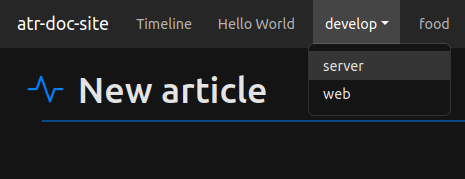

### ナビゲーションメニュー

新たにカテゴリを作った時に、ナビゲーションメニューの位置が気になったかもしれません。
前節で、`food` と `develop/server` と `develop/web` を作ることが出来ましたが、
`food` の位置を `develop` の位置の右側に配置したり、サブメニューの順序を変更したいかもしれません:

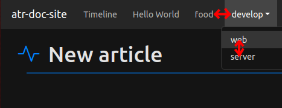

この順序は、`atr.json` の `menuOrder` 変数で指定できます:

```json
{
  "variables": {
    "menuOrder": ["timeline", "hello", "food", "web", "server"],
  }
}
```

`menuOrder` には、カテゴリのディレクトリ名を指定します。そして、サブカテゴリであっても親カテゴリ名を指定せず、サブカテゴリ名だけで指定してください。
このリストの指定通りの順序が維持されるように、ナビゲーションメニュー項目が配置されます。

サブカテゴリ名は、親カテゴリが分割されるような指定を行ったとしても、その通りのメニュー配置にはならず、単に順序だけが反映されることに注意してください。
つまり、以下の指定は同じ結果となります:

- `"menuOrder": ["timeline", "hello", "web", "food", "server"]`
- `"menuOrder": ["timeline", "hello", "web", "server", "food"]`

また、ここに指定されていないカテゴリが存在する場合は、メニューの後端に追加されます。

雛形に含まれる、`about` カテゴリのメニューが右端に配置される事も気になるでしょう。
左端に配置できれば、自己紹介などのコンテンツとは異なる文書を配置して分けることが出来ます:

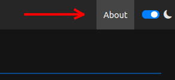

これは、`afterMenuOrder` 変数で指定できます:

```json
{
  "variables": {
    "afterMenuOrder": ["about"],
  }
}
```

`afterMenuOrder` は常に `menuOrder` の指定の後で評価されることに注意してください。
`afterMenuOrder` に指定したカテゴリが、 `menuOrder` に含まれていると、左側のグループに配置されてしまいます。

タイムラインカテゴリは特殊なカテゴリと説明しましたが、カテゴリ名 `timeline` を使うことで、ナビゲーションメニューでのタイムラインの位置を調整することも出来ます。
敢えてタイムラインを右端（`afterMenuOrder`）に配置して、校正済みのドキュメントを全面に押し出したサイトにすることも出来ます。

### フロントページとタイムライン

フロントページとは、そのサイトの先頭のページです。 `http://foobar.github.io/foobar/` のようなURLで公開された場合に、 `http://foobar.github.io/foobar/index.html` として配信されるページです。

これまで、a-terra-forgeのフロントページは常にタイムラインページを表示するという前提で説明してきましたが、
フロントページを任意のカテゴリに変更することが出来ます。以下はフロントページを `food` に変更する例です:

```json
{
  "variables": {
    "frontPage": "food",
  }
}
```

フロントページの変更は、デプロイするアセットファイルの位置が変更されることに注意してください。

例えば、デフォルトのタイムラインがフロントページの場合は、タイムライン用のアセットファイル（`timeline.json`, `timeline-bodies/*`: 自動生成される）が、`dist/` 直下に配置されます。
その後 `food` をフロントページに変更すると、代わりに `food` のアセットファイル群が `dist/` 直下に配置され、タイムラインは `dist/timeline/` に配置されるようになります。

つまり、ページに訪問するユーザーから見えるURLのパスが変化することになります。
ページ構造はサイトマップにも反映されるので、検索エンジンのクローラーなどはその変化を検知できると思われますが、頻繁に変更すると恐らくペナルティを課せられると思われます。
（検索エンジンの都合であなたの歩みを止めるのは本末転倒かもしれませんが...）

タイムラインについての補足:

- `frontPage` に `timeline` と指定するか、 `frontPage` を省略した場合
- または、 `menuOrder` や `afterMenuOrder` のどこかに `timeline` を配置した場合

は、タイムラインページが生成されます。
しかし、`timeline`指定が存在しない場合は、タイムラインページは生成されません。

タイムラインページの描画は、a-terra-forgeの特徴的な機能の一つなので使ってほしいところですが、どうしても不要な場合は、このようにしてタイムラインページを省くことが出来ます。

### メッセージ置換と言語

ここまでの説明でまだ明らかにしていない、気になる描画があるはずです。それは、ナビゲーションバーに表示される名称や、タイムラインのカテゴリバッジです:

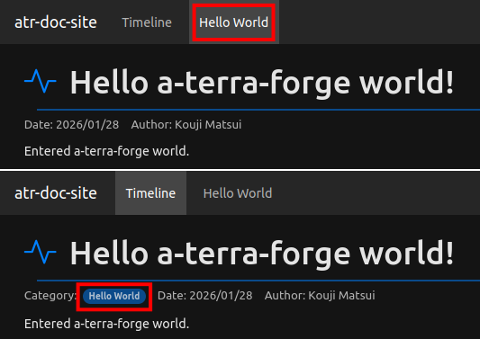

このカテゴリは `docs/hello/` に配置されていますが、表示は上の通り、`Hello world`と表示されています。
ここまでの作業では、カテゴリのディレクトリ名がそのまま表示されていました。

このカスタマイズを行うには、`atr.json` の `messages` 変数を定義します:

```json
{
  "variables": {
    "locale": "en"
  },
  "messages": {
    "en": {
      "date": "Date",
      "author": "Author",
      "category": "Category",
      "timeline": "Timeline",
      "hello": "Hello World",
      "about": "About",
      "endOfTimeline": "End of timeline.",
      "noArticlesYet": "No articles yet.",
      "uncommitted": "uncommitted"
    },
    "ja": {
      "date": "日時",
      "author": "執筆者",
      "category": "カテゴリ",
      "timeline": "タイムライン",
      "hello": "ハローワールド",
      "about": "About",
      "endOfTimeline": "タイムラインは以上です",
      "noArticlesYet": "文書はありません",
      "uncommitted": "未コミット"
    }
  },
}
```

見ての通り、この定義は英語と日本語に分かれていますが、`messages.en.hello` に、 `Hello World` と指定されています。これが表示に反映されているのです。

- この変数に指定されていないカテゴリ名は、カテゴリ名そのものとして描画されます。 `food` が `food` として描画されたのがこの理由です。
  試しに `"food": "The Food"` のように定義を追加してみてください。カンマ区切りを忘れずに。
- `messages` 変数の直下には、「ロケール名」（言語）が配置されます。
  上記の例では`en`と`ja`ですが、これらは `variables.locale` の指定に対応していて、雛形ではこれが `en` に設定されているので、 `messages.en.hello` が使用されています。
- そして、ロケール名は `en` と `ja` に限定されず、任意の名称を使用できます。
  私が日本語と（かろうじて）英語しかわからないので、この2つだけが雛形に含まれているのです。
  あなたの母語は何ですか？ ぜひここに加えて、カスタマイズしてください。

この `messages` は、カテゴリ名の解決だけでなく、いくつかの共通の描画箇所で使用されています。
試しに、 `variables.locale` を `en` から `ja` に変更すると、それを実感できるはずです:

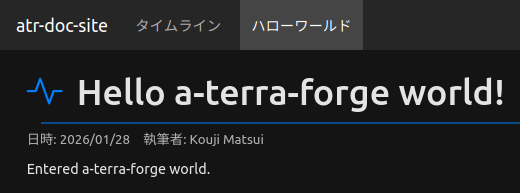

他にも、執筆者のGitシグネチャをそのまま出力したくないかもしれません。次のような設定を加えれば:

```json
{
  "messages": {
    "en": {
      "Kouji Matsui": "kekyo"
    },
    "ja": {
      "Kouji Matsui": "けきょ"
    }
  },
}
```

執筆者を自動的に置き換えることが出来ます:

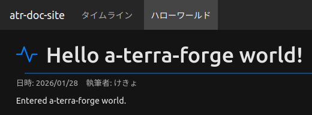

これを実現しているのは、funcityスクリプト内の `getMessage` という関数です。もし、既存のテンプレートでも `messages` を参照していない箇所や、自分でカスタマイズしたHTMLの一部でも `messages` による置き換えを実現したい場合は、後述の「テンプレートのカスタマイズ」を参照してください。

### ブログカテゴリ

a-terra-forgeは、ブログを執筆するための機能も持っています。但し、オプショナルな機能なので、以下の方法で有効化する必要があります:

- ブログは、指定したカテゴリをブログのように「時系列降順」で読ませるための機能です。
- `atr.json` の `variables.blogCategories` に、ブログとして使用するカテゴリを指定します。
  カテゴリを転用する、という方法なので、任意のカテゴリ（複数可）をブログのように描画することが出来ます。
- ブログページは、タイムラインにかなり近い描画を行います。最新の文書はスタティック生成され、古い記事は無限スクロール（デマンド読み込み）が行われます。
  従って、ブログが長期に渡って蓄積されても、1ページの物理的なHTMLサイズを一定の範囲に制約できます。

以下のように、ブログに転用するカテゴリ名を指定します:

```json
{
  "variables": {
    "blogCategories": ["blog"]
  },
}
```

ナビゲーションメニューのどこにメニューを配置するのかは、これまで述べてきた `menuOrder` などの指定で決定されるので、配置の自由度は通常のカテゴリと同様です。
タイムライン同様に、動的に読み込むHTMLが `blog-bodies/` に配置されます。

---

ここまでの解説で、a-terra-forgeの基本的な執筆方法は網羅しました。
以降は、文書以外のコンテンツの挿入方法について説明します。

### 画像の挿入

文書に画像を挿入するには、その画像をカテゴリディレクトリ内に配置して、markdownの画像参照を書くだけです:

```markdown

```

自動的に、「パネル」と呼ばれる枠内にイメージが描画され、パネルは右側に配置されます（ビューポート幅が狭くなると、幅全体を専有します）。画像に続く文書は「回り込み」配置されるので、画像参照しながら文書を読むことが出来ます。
また、ページ閲覧者が画像をクリックすると、その画像がポップアップされて、（ビューポートの幅が広ければ）より拡大した画像を見ることが出来ます。

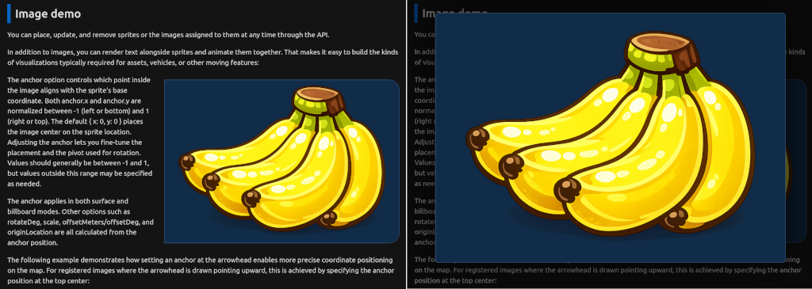

次のように、markdownのリンクで囲む場合は、クリックしても拡大表示は行われず、単にそのページを新たに開きます。

```markdown
[](https://example.com/banana/)
```

画像の配置と参照は、ブログシステムなどでも編集操作が面倒なタスクの一つです。
a-terra-forgeでは、編集に使うエディタに操作上の問題を丸投げしています。

例えば、Visual Studio Codeの場合、編集スペース内の文書markdownファイルを開いておき、そこにドラッグアンドドロップで画像ファイルを落とす（Shiftキーを押している必要がある）と、自動的に画像ファイルがコピーされ、 `` のような定義が挿入されます:

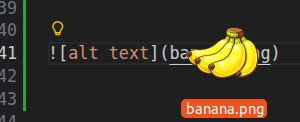

後はこれを少し手直しするだけで、画像の配置が完了します。

### コードの挿入

markdownを日常的に記述しているのであれば、コードブロックについては馴染みが深いかもしれません。
これは、テキストファイルに相当するコンテンツを見やすく描画する機能で、markdownでは以下のように記述します:

````markdown
```typescript
const run = async (
  script: string,
  logs: FunCityLogEntry[] = []
): Promise<string> => {
  // Run the tokenizer
  const blocks: FunCityToken[] = runTokenizer(script, logs);

  // :
  // :
  // :

  const text: string = results.join('');
  return text;
};
```
````

` ```typescript ... ``` ` のように、バッククオート3個と言語指定（オプション）で始めると、バッククオート3個が再び現れるまでをコードブロックとして認識します。その結果、その間のテキストが次のように描画されます:

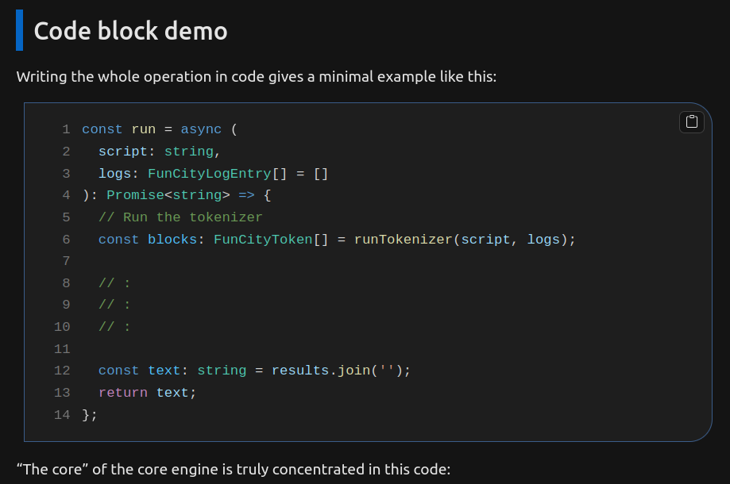

- コードブロックは、ビューポートの横幅いっぱいまで広がります。横スクロールの機会を減らすことで、読みやすさを向上させます。
- コードブロックには、コピーアンドペーストの為にコピーするボタン（右上）があります。
  行番号はコピーコードに含まれないので、コードを簡単にコピーして試すことが出来ます。
- コードブロックの描画は、 [Shiki](https://shiki.style/) で実現しています。対応する言語は https://shiki.style/languages を参照してください。

コードブロックを囲む枠線は、`primaryColor` に従った色が使用されますが、シンタックスハイライト（コード中の色付け）は、Shikiのテーマに従って描画されます。その他の Shiki の設定も含めて、 `atr.json` の `variables.codeHighlight` で指定します:

```json
{
  "variables": {
    "codeHighlight": {
      "lineNumbers": true,
      "theme": {
        "light": "light-plus",
        "dark": "dark-plus"
      }
    }
  }
}
```

|キー名|詳細|
|:----|:----|
|`lineNumbers`|`true`で行番号を表示する。|
|`theme`|適用するテーマを指定する。ライト・ダークテーマそれぞれで異なるテーマを指定できる。指定可能なテーマの名称は https://shiki.style/themes を参照。デフォルトは `light-plus` と `dark-plus` で、Visual Studio Codeに似た配色。|

### カードの挿入

カードとは、以下のようなスタイルの、外部リンク表示です:


実際には大きく分けて2種類のカードがあります。

- oEmbedカード: [oEmbed provider](https://oembed.com/) 対応のリンクの場合に、埋め込みコンテンツ（例えばYouTubeなら、ページ上で動画プレビューを再生できる）を配置して、インタラクティブなリンクとして機能します。
- OGPカード: [Open Graph protocol](https://ogp.me/) メタデータを提供しているページの場合に、その情報に基づいてカード形式でリンクを描画します。
  a-terra-forgeでは、OGPメタデータが提供されていないページも、この方法で描画します。

カードとしてリンクを表示させるには、markdownのコードブロックに `card` と指定して、リンクを書くだけです:

````markdown
```card
https://youtu.be/mfv0V1SxbNA
```
````

指定されたリンクがoEmbedプロバイダー対応のリンクの場合は、自動的に埋め込みコンテンツとしての描画を試みます。
そうでない場合は、OGPカードとして描画します。

最初に挙げた例はYouTubeのリンクなので、oEmbedカードとして描画されました。
以下の例ではGitHubのリンクで、GitHubはOGPによる情報を提供しているので、OGPカードとして描画しています:

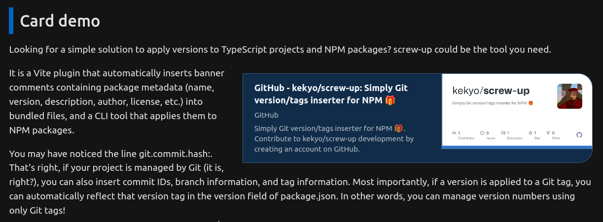

どちらの場合も、画像と同じように「パネル」に配置され、ビューポート幅が十分に広い場合は文書が回り込み配置されます。

oEmbedとOGPの情報を取得する処理は、[mark-deco](https://github.com/kekyo/mark-deco/) によって行われています。同じリンクに対して何度も同じ要求を送信しないように、これらのプロバイダーへのアクセスはキャッシュされています。
キャッシュされた情報は、 `<ホームディレクトリ>/.cache/a-terra-forge/` ディレクトリに保存されます。
もし、エラーが発生して解消しない場合は、このディレクトリを削除してみてください。

### Mermaidによる図の挿入

[Mermaid](https://mermaid.js.org/) を使うと、markdown内に図表を直接埋め込めます。
markdownのコードブロックに `mermaid` を指定して、図の定義を記述します:

````markdown
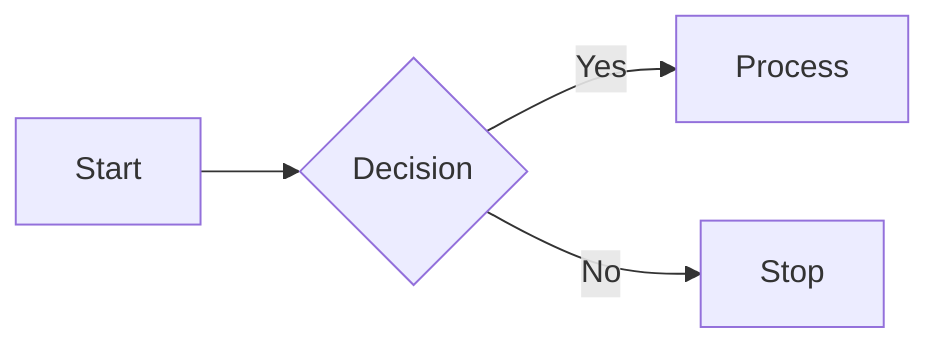
````

図表は自動的にレンダリングされ、文書内に表示されます:

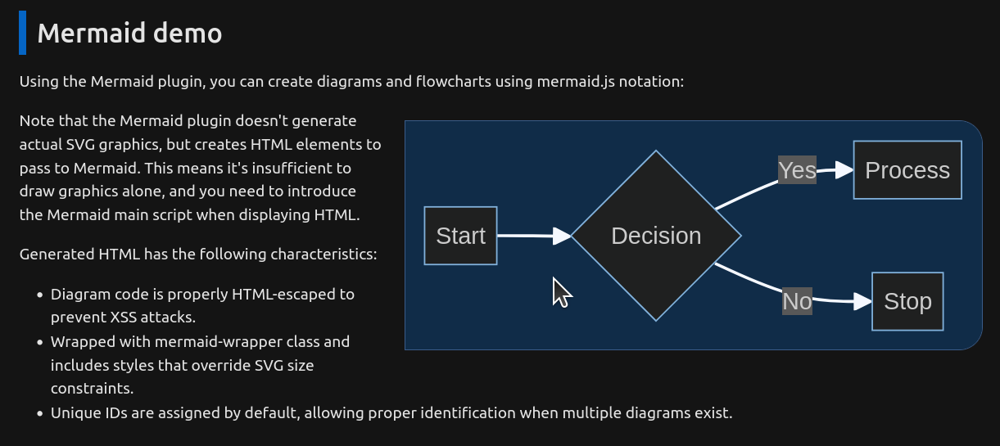

定義はテキストのまま管理できるため、差分管理やレビューに向いています。
しかし、結果がどのように描画されるかを、見ないで書くのは難しいかもしれません。

例えば、[Visual Studio Codeのサードパーティ拡張機能](https://marketplace.visualstudio.com/search?term=mermaid&target=VSCode&category=All%20categories&sortBy=Relevance) を使えば、グラフの結果をもっと素早く確認したり編集することが出来ます。

注意: Mermaidは、他の埋め込み機能と異なり、記述したグラフのコードが殆どそのままHTMLに出力されます。
実際の「グラフ図形」を描画しているのは、クライアント側のブラウザで実行されるMermaidのランタイムJavaScriptコードです。

従って、SVGコードが直接HTMLに出力されるわけではなく、Mermaidランタイムへの参照が必要となります。
a-terra-forgeの雛形にはこのコードが含まれているため、すぐに使い始めることが出来ますが、テンプレートをカスタマイズする際には知っておいたほうが良いかもしれません。

---

## atr.json

以下に、`atr.json`に定義済みの全ての値を示します:

|変数名|テンプレートのみ|詳細|
|:----|:----|:----|
|`baseUrl`|No| このサイトのデプロイ後の公開基底URLを指定します。ナビゲーションメニューに影響はありませんが、サイトマップの生成には必要なので、設定してください。|
|`siteName`|No| このサイトのサイト名で、ナビゲーションメニューの左端の表示や、ページメタデータの埋め込みに使用されます。 |
|`siteDescription`|No| このサイトの説明文で、ページメタデータの埋め込みに使用されます。 |
|`locale`|No| サイト全体の言語指定です。文書にも個別に指定することが出来ますが、省略された場合にこの値が使用されます。例えば英語の場合は`en`、日本語の場合は`ja`です。この指定を行っても、コンテンツが自動的に翻訳されるわけではありません。 |
|`frontPage`|No| サイトのフロントページ（トップページ）として、どのカテゴリを表示するかを指定します。既定は`timeline`で、これはタイムラインを表示する、特殊なカテゴリ名です。 |
|`headerIcon`|Yes| 文書のタイトルに表示するアイコンの指定です。名称は [bootstrap icons](https://icons.getbootstrap.com/) で指定します。文書にも個別に指定することが出来ますが、省略された場合にこの値が使用されます。 |
|`primaryColor`|Yes| サイトのプライマリ（優先）アクセントカラーを指定します。雛形が青色のアクセントを多用しているのはこの指定によるものです。この色を変えれば、あなたの好みのアクセントカラーに変更できます。但し、システムテーマのlightとdarkでバランスの取れている色味を試行錯誤することを忘れずに。 |
|`secondaryColor`|Yes| サイトのセカンダリ（補間）アクセントカラーを指定します。セカンダリカラーは今の所、ブロッククオートでのみ使用しています。 |
|`inlineCodeColor`|Yes| サイトのインラインコードカラーを指定します。これは、markdown上でバッククオートで囲まれた文字（インラインコード）の色です。インラインコードの背景色もこの指定から着色されます。 |
|`maxWidth`|Yes| 文書エリアの最大幅を指定します。デフォルトは無制限で、ビューポートの横幅の広がりに無制限で追従します。横方向に広がりすぎると、目線で行を追うことが難しくなる場合があるため、 `90rem` のように指定することで、これを抑制できます。 |
|`codeHighlight`|No| Shikiのコードハイライト設定です。詳細は「コードハイライト設定」を参照してください。 |
|`siteTemplates`|No| サイト共通のアセットファイルで、funcityによるスクリプト処理を行うテンプレートファイル群を指定します。CSSやJavaScriptファイル、RSS/Atom、サイトマップなどは、全てスクリプトとして処理されて出力されます。追加のスクリプト処理が必要なファイルはこのリストに追加することで、同じようにスクリプト処理の対象として認識させることが出来ます。デフォルトは、`site-style.css`,`site-script.js`,`feed.xml`,`atom.xml`,`sitemap.xml`です。|
|`contentFiles`|No| ビルド時に文書ディレクトリ以下から追加でコピーする静的ファイルの glob パターンを指定します。画像などの補助ファイルを出力先に展開したい場合に使います。デフォルトは、`./**/*.png`, `./**/*.jpg`です。 |
|`assetsDir`|No| アセットを配置するディレクトリパスです。デフォルトは `assets/` で、パスは `atr.json` があるディレクトリから解決されます。この配下のファイルはディレクトリ構造を保ったまま `outDir` にコピーされます（例: `assets/favicon.ico` → `dist/favicon.ico`）。 |
|`docsDir`|No| 文書ディレクトリです。デフォルトは `docs/` で、パスは `atr.json` があるディレクトリから解決されます。 |
|`templatesDir`|No| テンプレートディレクトリです。デフォルトは `templates/` で、パスは `atr.json` があるディレクトリから解決されます。 |
|`outDir`|No| 出力ディレクトリです。デフォルトは `dist/` で、パスは `atr.json` があるディレクトリから解決されます。 |
|`tmpDir`|No| 一時作業ディレクトリです。デフォルトはシステムテンポラリディレクトリで、パスは `atr.json` があるディレクトリから解決されます。 |
|`cacheDir`|No| oEmbed/OGP探索キャッシュディレクトリです。デフォルトは `$HOME/.cache/a-terra-forge/` で、パスは `atr.json` があるディレクトリから解決されます。 |
|`feedSummaryLength`|No| RSS/Atomのエントリ要約の最大長です。デフォルトは `200` です。 |
|`feedTitle`|No| RSS/Atomのタイトルです。`siteName` が空の場合は `"feed"` が使われます。 |
|`feedDescription`|No| RSS/Atomの説明文です。デフォルトは `siteDescription` の値です。 |
|`prerenderCount`|No| ページに事前描画する件数です。デフォルトは `5` です。 |
|`menuOrder`|No| 認識したカテゴリを、どの順序でナビゲーションメニューに表示させるのかを決定するリストです。ここに明示のないカテゴリは、これらのリストの終端に配置されます。また、個々に明示されているのに存在しないカテゴリは無視されます。 |
|`afterMenuOrder`|No| 認識したカテゴリを、どの順序でナビゲーションメニューに表示させるのかを決定するリストです。但し、このリストは、ナビゲーションメニューの右寄せで表示されます。一般カテゴリとは分けて置きたい場合に使用できます。 |

- 「テンプレートのみ」とは、a-terra-forge変換プロセスはこの値を使用せず、テンプレートアセット内で変数として参照されるものです。
- ここに示した変数以外にも、 [funcityで標準的に使用可能な変数群](https://github.com/kekyo/funcity/blob/main/README_ja.md#%E6%A8%99%E6%BA%96%E9%96%A2%E6%95%B0) も使用できます。
- また、あなた自身で独自に変数値を定義して、それをfuncityスクリプト内から参照することが出来ます。
  これは特に、一度定義したパラメータ値のようなものを、funcityスクリプト内で繰り返し使用し、値の管理を一元化することに役立ちます。

### コードハイライト設定

`variables.codeHighlight` に、Shiki のシンタックスハイライト設定を指定します。

|キー名|詳細|
|:----|:----|
|`lineNumbers`|`true` で行番号を表示します。 |
|`theme`|適用するテーマを指定します。文字列またはライト/ダークのオブジェクトを指定できます。 |
|`theme.light`|ライトテーマ名です。 |
|`theme.dark`|ダークテーマ名です。 |
|`languages`|登録する言語一覧です。指定した言語は同名で `languageAliases` にも追加されます。 |
|`languageAliases`|言語エイリアスのマップです（`alias`: `language`）。 |
|`defaultLanguage`|コードブロックで言語指定がない場合のデフォルト言語名です。 |

---

## テンプレートのカスタマイズ

TODO:

---

## その他

このジェネレータの初期アイデアは10年ほど前に遡り、一度 [.NETで具現化](https://github.com/kekyo/MarkTheRipper/) させようとしたのですが、（ソフトウェア外の）問題が色々重なって放置状態となっていました。
今回、新たにTypeScriptで書き直して、ようやく形になりました。.NET実装での反省点をいくつかブラッシュアップして、良いものに仕上がったと思っています。

近いうちに、私のブログサイトも、WordPressからa-terra-forgeに置き換えて、ドッグフーディングします。

[それで結局、 "a-terra-forge" とは何なのか？という話なんですが...](<https://ja.wikipedia.org/wiki/%E9%98%BF%E5%AF%BA%E5%B7%9D_(%E9%95%B7%E9%87%8E%E7%9C%8C)>) まあ殆ど後付けなんだけどね ;)

## License

Under MIT.
