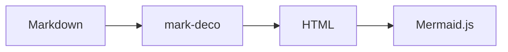

## Image demo

You can place, update, and remove sprites or the images assigned to them at any time through the API.

In addition to images, you can render text alongside sprites and animate them together. That makes it easy to build the kinds of visualizations typically required for assets, vehicles, or other moving features:


The anchor option controls which point inside the image aligns with the sprite’s base coordinate. Both anchor.x and anchor.y are normalized between -1 (left or bottom) and 1 (right or top). The default { x: 0, y: 0 } places the image center on the sprite location. Adjusting the anchor lets you fine-tune the placement and the pivot used for rotation. Values should generally be between -1 and 1, but values outside this range may be specified as needed.

The anchor applies in both surface and billboard modes. Other options such as rotateDeg, scale, offsetMeters/offsetDeg, and originLocation are all calculated from the anchor position.

The following example demonstrates how setting an anchor at the arrowhead enables more precise coordinate positioning on the map. For registered images where the arrowhead is drawn pointing upward, this is achieved by specifying the anchor position at the top center:

## oEmbed demo

"Building the PERFECT Linux PC with Linus Torvalds"

```card
https://youtu.be/mfv0V1SxbNA
```

It is finally here, the computer build you have (and possibly the whole world) been waiting for. The Linus Tech Tips and Linus Torvalds Collab PC build! Linus Torvalds talks through Linux development, parts selection, and even gives a glimpse into some cool projects he works on in his spare time. This project was made with a lot of hard work from our team and of course Linus Torvalds generous time.

## Card demo

Looking for a simple solution to apply versions to TypeScript projects and NPM packages? screw-up could be the tool you need.

```card
https://github.com/kekyo/screw-up
```

It is a Vite plugin that automatically inserts banner comments containing package metadata (name, version, description, author, license, etc.) into bundled files, and a CLI tool that applies them to NPM packages.

You may have noticed the line git.commit.hash:. That's right, if your project is managed by Git (it is, right?), you can also insert commit IDs, branch information, and tag information. Most importantly, if a version is applied to a Git tag, you can automatically reflect that version tag in the version field of package.json. In other words, you can manage version numbers using only Git tags!

This calculates the version number by measuring the commit height to the current HEAD based on the last applied version tag.

## Mermaid demo

Using the Mermaid plugin, you can create diagrams and flowcharts using mermaid.js notation:



Note that the Mermaid plugin doesn't generate actual SVG graphics, but creates HTML elements to pass to Mermaid. This means it's insufficient to draw graphics alone, and you need to introduce the Mermaid main script when displaying HTML.

Generated HTML has the following characteristics:

- Diagram code is properly HTML-escaped to prevent XSS attacks.
- Wrapped with mermaid-wrapper class and includes styles that override SVG size constraints.
- Unique IDs are assigned by default, allowing proper identification when multiple diagrams exist.
